# Hạn Trời

Tower Defense — A Chain to Heaven

Game thủ thành với cơ chế **NỐI**: trụ không tự ngắm bắn. Người chơi kéo dây giữa các trụ
để dựng đường bay của đạn, và quái trúng đạn khi cắt ngang đoạn dây đó.
Damage nằm trên sợi dây người chơi vẽ, không nằm ở trụ.

Android · Unity 6000.3.21f1

---

## 0. Mục lục

1. [Architecture](#1-architecture)
2. [Techniques](#2-techniques)
3. [Data](#3-data)
4. [Graphic](#4-graphic)
5. [Tools](#5-tools)
6. [Workflow AI](#6-workflow-ai)
7. [Dung lượng & Performance](#7-dung-lượng--performance)

---

## 1. Architecture
### 1.1 Layered Architecture
<p>
  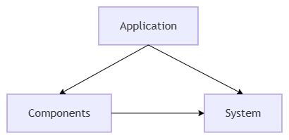
  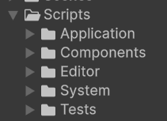
</p>

### Định nghĩa các tầng

- **`System`** chứa plain C#: luật chơi, state, contract, definition và tính toán. Không có class nào kế thừa `MonoBehaviour`; các object được tạo bằng `new` và nhận dependency qua constructor. Vì không cần `GameObject` hay scene, đây là nơi viết và chạy unit test.
- **`Components`** chứa các `MonoBehaviour` nằm trên GameObject, prefab hoặc scene. Chúng nhận input/callback của Unity, giữ reference tới Unity asset và hiển thị kết quả do `System` quyết định; không sở hữu luật chơi hay application lifecycle.
- **`Application`** là tầng composition. `LifetimeScope` của VContainer đăng ký dependency, tạo các system đúng lifetime, rồi `EntryPoint` gọi `Start`, `Tick`, `LateTick` và `Dispose` theo vòng đời Unity.

Mọi mũi tên là tham chiếu assembly, một chiều. `System` không tham chiếu tới `Components`, `Application`, VContainer hay UnityEditor.

### Lợi ích

- Test ngay trong Edit Mode — không cần mở scene, không cần vào Play Mode
- Dễ thay skin — đổi giao diện mà không động vào logic
- Dễ đọc — Logic game tách với hiển thị trên màn hình

```Vì Game Tower Defense nặng về mặt hệ thống, nên ưu tiên giải pháp tốt cho testing hệ thống```

### 1.2 Assembly Definition

Ba tầng ở mục 1.1 không phải là quy ước đặt thư mục — chúng là **ba assembly riêng**, và
ranh giới đó do trình biên dịch ép, không do người tự giữ.

| `.asmdef` | Tham chiếu tới | Platform | Vai trò |
|---|---|---|---|
| `TowerDefense3D.System.Runtime` | *(rỗng)* | mọi platform | Luật chơi, plain C# |
| `TowerDefense3D.Components.Runtime` | `System`, `Unity.InputSystem`, `Unity.ugui`, `Unity.TextMeshPro` | mọi platform | `MonoBehaviour`, view |
| `TowerDefense3D.Application.Runtime` | `System`, `Components`, `VContainer` | mọi platform | Composition, `LifetimeScope`, `EntryPoint` |
| `TowerDefense3D.Editor` | `System`, `Components`, URP Runtime, TestRunner | **Editor** | Tool, importer, report |
| `TowerDefense3D.EditModeTests` | 3 assembly game + `Editor` + `VContainer` | **Editor** | Test luật chơi |
| `TowerDefense3D.PlayModeTests` | 3 assembly game + `Unity.InputSystem.TestFramework` | mọi platform | Test có scene |

Dòng đáng chú ý nhất trong cả bảng là dòng đầu tiên: `"references": []`. `System` **không
tham chiếu tới bất cứ thứ gì** — không `Components`, không `Application`, không VContainer,
không `UnityEditor`. Đây không phải lời hứa trong tài liệu mà là một dòng trong file
`.asmdef`: viết `using` để chạm vào một `MonoBehaviour` từ trong `System` sẽ **không biên
dịch được**, ngay tại lúc gõ, chứ không phải đợi tới lúc code review mới phát hiện.

#### Vì sao tách assembly thay vì chỉ tách thư mục

- **Ranh giới tầng trở thành lỗi biên dịch.** Mũi tên phụ thuộc một chiều ở sơ đồ 1.1 chỉ
  đúng chừng nào không ai vô tình vẽ ngược. Với `Assembly-CSharp` mặc định (mọi script nằm
  chung một assembly khổng lồ), mọi class đều thấy mọi class, và "tầng" chỉ còn là quy ước
  tinh thần. Với `.asmdef`, chiều mũi tên là cấu hình của trình biên dịch.
- **Không dịch lại cả project mỗi lần sửa một dòng.** Unity chỉ dịch lại assembly bị đổi và
  những assembly tham chiếu tới nó. Sửa một view trong `Components` không kéo theo việc
  dịch lại `System`. Đây là chi phí phải trả **mỗi lần lưu file**, nên rút ngắn nó ảnh
  hưởng tới toàn bộ thời gian phát triển chứ không chỉ một lần.
- **Code Editor không lọt vào build.** `TowerDefense3D.Editor` khai báo
  `"includePlatforms": ["Editor"]`. Tool, importer và report ở mục 5.2 tồn tại trong Editor
  và **không hề tồn tại** trong APK — không cần rào `#if UNITY_EDITOR` quanh từng file,
  cũng không sợ sót một file rồi vô tình kéo `UnityEditor` vào bản Android.
- **Test không đi theo game.** Hai assembly test đặt `"autoReferenced": false` và
  `"defineConstraints": ["UNITY_INCLUDE_TESTS"]` — chúng chỉ tồn tại khi Test Runner bật.
  Game không thể lỡ tay tham chiếu vào code test, và code test không chiếm một byte nào
  trong bản phát hành.
- **Chỉ thấy đúng package được phép thấy.** `System` không tham chiếu Input System, uGUI
  hay TextMeshPro nên nó không thể lén phụ thuộc vào chúng; `Components` mới là nơi được
  phép chạm vào ba package đó. Đây là thứ giữ cho unit test ở mục 1.1 chạy được ngoài
  Play Mode: không có gì trong `System` cần tới vòng đời Unity để khởi tạo.

#### Bất lợi

- Thêm một tham chiếu giữa hai tầng bây giờ là việc **sửa file `.asmdef`**, không phải chỉ
  gõ thêm một `using`. Cố tình làm cho việc phá tầng trở nên khó, nên nó cũng làm cho việc
  mở rộng hợp lệ chậm hơn một nhịp
- Chia nhỏ quá mức sẽ phản tác dụng: mỗi assembly là một DLL, số DLL nhiều lên thì thời
  gian nạp domain lúc vào Play Mode cũng tăng. Project dừng ở đúng 6 assembly (3 runtime,
  1 editor, 2 test), không chia tiếp theo từng feature
- Tham chiếu vòng bị cấm tuyệt đối — hai hệ thống muốn gọi lẫn nhau thì buộc phải dựng
  interface ở tầng dưới (đúng cơ chế `ISoundPlayer` ở mục 1.3), không có đường tắt

### 1.3 VContainer

VContainer là thư viện **Dependency Injection** cho Unity. Nó giữ một "cuốn sổ" ánh xạ
interface sang bản hiện thực, rồi tự đọc constructor để đưa đúng thứ vào — không ai
`new` bằng tay, cũng không ai đi tìm bằng `FindObjectOfType`.

```csharp
builder.Register<TowerNetworkSystem>(Lifetime.Scoped);        // tạo: plain C#
builder.RegisterComponent(audioPlayback).As<ISoundPlayer>();  // nối: MonoBehaviour có sẵn
```

Hai dòng trên là hai việc khác nhau: system được **tạo ra**, còn component thì Unity đã tạo
sẵn trong scene nên chỉ được **nhặt về và ép qua interface** mà `System` sở hữu.
Đây chính là chỗ mũi tên phụ thuộc đảo chiều: `System` cầm `ISoundPlayer` mà không biết
vật thật là `AudioPlaybackView`.

#### Application scope và Level scope

Project có hai scope lồng nhau, tương ứng với hai vòng đời có thật trong game.

**`ApplicationLifetimeScope`** nằm trong Bootstrap scene và sống suốt phiên chơi. Nó giữ
20 binding `Lifetime.Singleton` — những thứ phải sống qua nhiều màn: `SaveSystem`,
`TutorialProgress`, âm thanh, điều phối luồng game và chuyển cảnh.

**`LevelLifetimeScope`** nằm trong scene của từng màn, được dựng lên khi scene đó load
additive và bị huỷ khi rời màn. Nó giữ 33 binding `Lifetime.Scoped` — toàn bộ những gì
chỉ có nghĩa trong một màn: bàn cờ, mạng lưới trụ, đợt quái, mô phỏng chiến đấu, HUD.

Scope con **thấy được** scope cha, nhưng không có chiều ngược lại: hệ thống trong màn xin
được `SaveSystem`, còn `SaveSystem` không biết màn nào đang chạy. Nhờ vậy thứ sống lâu
không bị ràng buộc vào thứ sống ngắn.

Khi rời màn, scope con bị dispose và cả 33 hệ thống chết cùng lúc. Đây là khác biệt lớn
nhất so với singleton kiểu `static Instance`: singleton chỉ có một vòng đời là mãi mãi,
nên state của màn cũ dinh sang màn mới và phải viết `Reset()` thủ công — hàm mà cứ thêm
field mới là lại quên cập nhật.

#### Lợi ích

- Phụ thuộc hiện rõ trên constructor — nhìn chữ ký là biết class cần gì
- Không có global state — không singleton, không đi tìm object trong scene
- State không rò sang màn sau — scope chết thì system chết theo
- Test dựng thẳng bằng `new` với stub, không cần container

### 1.4 Single Entry Point

Cả game chỉ có **một** nơi nhận vòng đời Unity. `ApplicationEntryPoint` không phải
`MonoBehaviour` — nó implement interface của VContainer, và container là bên bơm
`Start` / `Update` / `LateUpdate` vào.

```csharp
public sealed class ApplicationEntryPoint : IAsyncStartable, ITickable, ILateTickable, IDisposable
{
    public void Tick()
    {
        float deltaTime = Time.deltaTime;
        applicationSystems.Tick(deltaTime);
        activeLevelSystems.Tick(deltaTime);
    }
}
```

Scope và entry point là hai vai tách bạch: **scope tạo, entry point chạy**. Entry point
không `new` ra thứ gì, nó nhận sẵn qua constructor rồi gọi các system theo thứ tự.

`LevelLifetimeScope` **không đăng ký entry point riêng**. Nó gắn nhóm system của mình vào
slot của scope cha, nên mở thêm màn cũng không sinh thêm vòng `Update()` nào.

#### Thứ tự cập nhật nằm trong code

Thứ tự chạy mỗi frame là một danh sách viết tay trong `SystemGroup`: input → camera
→ đặt trụ → tương tác trụ → mô phỏng → UI. Đọc một file là biết game làm gì mỗi frame.

Trong project chỉ còn **9 trên 364** file có `Update()` hoặc `LateUpdate()`, và cả 9 đều là
view trang trí như mây trôi hay đếm FPS. Tầng `System` không đọc `Time.deltaTime` lần nào
— thời gian được truyền vào như tham số. Project cũng không dùng Script Execution Order.

#### Lợi ích

- Thời gian vào game một chỗ — tăng tốc X2 hay slow-motion chỉ là một phép nhân tại nguồn
- Tạm dừng là một câu lệnh — không phải đi tắt `enabled` hàng loạt `MonoBehaviour`
- Không còn race thứ tự `Awake`/`Start`, không cần bảng Script Execution Order
- Khởi động có thứ tự và tắt máy có thứ tự — level dọn trước, application dọn sau
- Debug dễ hơn — mọi stack trace gameplay có chung một gốc

#### Bất lợi

- Một exception chưa bắt giữa `Tick()` sẽ chặn mọi system đứng sau nó trong frame đó

### 1.5 Facade

`TowerNetworkSystem` là mặt tiền duy nhất cho mạng lưới trụ — HUD và các hệ thống khác
không đụng trực tiếp vào `TowerNetworkManager` (nơi thực sự giữ đồ thị, hàng đợi, trạng
thái mô phỏng). Đổi cách lưu trữ bên trong không ảnh hưởng đến phía gọi.

### 1.6 MVP (Model – View – Presenter)

Mỗi màn HUD (Tower, Wave, Pause, Outcome, Cheat…) có một Presenter đứng giữa system và
view: presenter đọc state từ system, dựng **immutable state struct**, rồi gọi
`view.Render(state)`. View không tự quyết định hiển thị gì, chỉ vẽ lại những gì presenter
đưa xuống. Có 6 presenter trong project, mỗi cái test được bằng view stub khoảng 15 dòng.

### 1.7 Observer (Event)

System phát sự kiện bằng `event Action<T>` thay vì cho phép bên ngoài gọi thẳng vào.

```csharp
public event Action TowerSold;
public event Action<TowerFamily> ProjectileCreated;
```

24 event như vậy rải rác trong tầng `System`. Presenter, `SoundCueSystem`, VFX đều
subscribe thay vì system phải biết ai đang nghe — thêm một thứ phản ứng mới (âm thanh,
rung màn hình…) không phải sửa nơi phát sự kiện.

### 1.8 Data-driven bằng ScriptableObject

Luật chơi (tầm trụ, HP quái, lịch đợt, phản ứng nguyên tố…) nằm trong 13 loại
`ScriptableObject`, không hard-code trong script. Mỗi định nghĩa tự kiểm tra qua
`CollectValidationErrors()` — asset thiếu trường bắt buộc bị báo lỗi lúc load, không phải
lúc chơi mới lộ ra. Designer chỉnh số trong Inspector, không cần sửa code hay build lại.

#### Lợi ích chung

- Object Pool: không GC spike giữa đợt trên mobile
- Facade: đổi chi tiết bên trong không động đến nơi gọi
- MVP: view thay được, test được bằng stub
- Observer: thêm phản ứng mới không sửa nơi phát sự kiện
- ScriptableObject: designer tự chỉnh số, lỗi dữ liệu bắt được trước khi chạy

---

## 2. Techniques

### 2.1 Tick System

Hệ thống mô phỏng chạy theo **tick cố định 20 lần mỗi giây**, tách khỏi nhịp vẽ hình.
Dùng để xử lý chênh lệch FPS giữa các máy, tính trước kết quả cả đợt, và điều khiển
tốc độ game.

```csharp
clock.Advance(deltaTimeSeconds * SpeedMultiplier, Step);
```

Nhờ vậy máy 30 FPS và máy 120 FPS chạy ra cùng một kết quả, và tăng tốc X2 hay
slow-motion chỉ là một phép nhân — không rút ngắn độ dài một bước.

#### Không tương tác giữa đợt nên tính trước được cả đợt

Khi đợt quái đang chạy, người chơi không được đặt, bán hay nối lại trụ — `CanEditTopology`
chặn mọi thao tác sửa cấu trúc. Đây không phải hạn chế mà là điều kiện: vì không có gì
thay đổi giữa chừng, toàn bộ diễn biến của đợt **giải được trước khi nó bắt đầu**.

`CombatTimeline` mô phỏng cả đợt ngay lúc bấm Bắt đầu: từng viên đạn bay đâu, trúng ai,
phản ứng nguyên tố nổ lúc nào. Lúc chơi chỉ còn **phát lại** kế hoạch đó.

Va chạm được giải bằng phương trình bậc hai giữa hai vật chuyển động thẳng, không lấy
mẫu theo frame. Toàn project không có `OnTriggerEnter` hay `OnCollisionEnter` nào, và chỉ
có đúng một `Physics.Raycast` — dùng để đặt trụ, không dính gì tới chiến đấu.

#### Lợi ích

- Tính trước cả đợt — lúc chơi chỉ phát lại, khung hình nhẹ và đều
- Không phụ thuộc frame rate — mọi máy cho cùng một kết quả
- Không raycast, không collider, không physics trong lúc đánh
- Đạn nhanh cỡ nào cũng không xuyên qua quái, vì va chạm giải bằng toán
- Hỏi được sự kiện **chưa xảy ra** — tutorial biết trước phản ứng Sốc Nhiệt sắp nổ ở đâu
  để kịp kéo camera vào đúng con quái
- Test gọi 1000 tick trong vài mili-giây, không cần chờ 1000 frame thật

#### Bất lợi

- Không sửa được trụ giữa đợt — giá phải trả cho việc tính trước
- Đổi cách nối dây là phải tính lại toàn bộ kế hoạch, không sửa cục bộ được
- Kế hoạch của cả đợt phải giữ trong bộ nhớ suốt lúc chơi (Tốn ram)


### 2.2 Combat Timeline

`CombatTimeline` là nơi **ghi lại** kết quả mô phỏng cho cả đợt, theo từng tick: quái
sinh ra lúc nào, đứng ở đâu, đạn trúng ai, phản ứng nguyên tố nổ lúc nào. Mỗi loại sự
kiện nằm trong một `Dictionary<long, List<T>>` riêng, key là số tick.

```csharp
public void Step()
{
    long tick = towerNetworkManager.CurrentTick;
    ApplySpawns(timeline.GetSpawns(tick));
    PublishFireHits(timeline.GetFireHits(tick));
    PublishImpacts(timeline.GetImpacts(tick));
    PublishReactions(timeline.GetReactions(tick));
    ApplyFrames(timeline.GetFrames(tick));
}
```

`CombatTimelinePlanner` chạy toàn bộ đợt ngay lúc bấm Bắt đầu và đổ kết quả vào
`CombatTimeline`. Lúc chơi, `Step()` chỉ còn **tra bảng theo tick hiện tại** rồi phát sự
kiện — không tính toán gì thêm.

#### Hỏi được sự kiện chưa xảy ra

Vì cả đợt đã có sẵn trước khi chơi, hệ thống tra được tương lai:

```csharp
public bool TryFindUpcomingReaction(
    ElementReactionId reactionId, out long ticksUntil, out long enemyId, out Vector3 position)
```

Tutorial Sốc Nhiệt ở màn 2 dùng hàm này: biết trước ~1.5 giây rằng phản ứng sắp nổ ở
con quái nào, kịp kéo camera vào đúng mục tiêu và chạy chữ giải thích trước khi nó xảy ra.
Một mô phỏng chạy trực tiếp chỉ báo được **sau khi** xong — lúc đó chỉ còn cách kể lại.

#### Lợi ích

- Playback không phải tính toán lại — chỉ tra bảng theo tick
- Lookahead — truy vấn được sự kiện sẽ xảy ra, thay vì chỉ biết sau khi rồi
- Âm thanh và VFX bắn theo sự kiện đã lập kế hoạch — không dựa vào collision callback nên
  không bị sót hay kêu trùng
- Cùng một input luôn ra cùng một kết quả — bug tái hiện được thay vì "thỉnh thoảng mới bị"

#### Bất lợi

- Toàn bộ sự kiện của đợt nằm trong bộ nhớ từ lúc bấm Bắt đầu đến khi đợt kết thúc
- Planner và timeline là hai bước tách rời — sửa logic chiến đấu phải sửa đúng cả hai chỗ

---

### 2.3 Object Pool

Mẫu, đạn, hoạt cảnh quái đều đi qua `ComponentPool<T>` (bao quanh
`UnityEngine.Pool.ObjectPool<T>`) thay vì `Instantiate`/`Destroy` trực tiếp.

```csharp
Dictionary<GameObject, ComponentPool<TowerProjectileView>> poolsByPrefab;
```

Mỗi loại prefab một pool riêng, tạo lười khi gặp prefab mới. Không có pool thì mỗi
viên đạn là một lần `Instantiate` + `Destroy` — GC spike giữa đợt trên mobile.

Dùng ở: `TowerProjectilePoolView` (đạn), `EnemyViewPool` (quái), `ComponentPool<T>` dùng
chung với `collectionCheck: true` để bắt double-release ngay lần sai đầu tiên.

### 2.4 Particle Emitter dùng chung (shared rig)

Hiệu ứng one-shot (nổ, va chạm, phản ứng nguyên tố…) không phải mỗi lần chơi một
`Instantiate` `ParticleSystem` mới. `GlobalEffectEmitterView` dựng **một rig dùng chung
cho mỗi loại prefab**, đặt tại gốc toạ độ, rồi mọi lần gọi sau chỉ bắn hạt vào đúng vị trí
bằng `EmitParams` — không tạo thêm GameObject nào.

```csharp
var emitParams = new ParticleSystem.EmitParams
{
    position = position,
    applyShapeToPosition = true
};
system.Emit(emitParams, count);
```

`applyShapeToPosition` giữ đúng hình dạng hạt phun ra (Shape module) dù rig đứng yên tại
gốc — nếu thiếu cờ này, hạt sẽ dồn về đúng một điểm thay vì toả ra như bản gốc được author.

10 sự kiện xảy ra cùng lúc thì draw call **không tăng theo 10**, vì chúng dùng chung một
`ParticleSystem`. Đánh đổi: hiệu ứng phải đứng yên tại chỗ phát — cái gì cần bám theo một
mục tiêu di chuyển (đạn, dấu nguyên tố, khiên) không dùng được kỹ thuật này.

#### Lợi ích

- Draw call không tăng theo số sự kiện chồng lên nhau
- Không `Instantiate`/`Destroy` mỗi lần chơi hiệu ứng — không GC spike
- Giữ nguyên toàn bộ thiết lập gốc (material, curve, sub-emitter) vì rig là chính prefab
  được author, chỉ điều khiển emission bằng code

#### Bất lợi

- Không dùng được cho hiệu ứng phải bám theo vật thể đang di chuyển
- Rig dựng lười ở lần gọi đầu tiên — lần đầu chơi một hiệu ứng mới sẽ có chi phí dựng rig

### 2.5 VFX Prewarm

Lần đầu GPU vẽ một shader với một tổ hợp render state cụ thể, driver phải dựng pipeline
state object — trên Vulkan (lựa chọn hàng đầu của project trên Android) đây là chi phí
chiếm phần lớn, và chỉ trả **khi có draw call thật sự được gửi đi**. `RuntimeWarmupView`
tồn tại để trả chi phí đó lúc boot, ngoài màn hình, thay vì để người chơi trả lúc đang chơi.

Ba điều kiện đều phải đúng thì việc prewarm mới có tác dụng, thiếu một cái là coi như
không làm gì trong khi trông vẫn như đang chạy:

- Vật phải nằm trong frustum của camera — đứng ngoài khung hình thì bị cull, không có
  draw call nào được gửi
- Phải tồn tại đủ một frame thật — sinh ra rồi huỷ trong cùng một frame thì chưa kịp render
- Particle system phải có hạt đang sống — emitter không có hạt thì không phát sinh draw call

Hiệu ứng và quái được làm nóng riêng vì chúng đi qua đường vẽ khác nhau: hiệu ứng là hạt,
đi qua đúng `GlobalEffectEmitterView` mà lúc chơi thật sẽ dùng; quái là skinned mesh dưới
animator, dùng shader và vertex path khác — làm nóng cái này không chạm tới cái kia.

Camera dùng để prewarm render vào một render texture off-screen thay vì màn hình, và giữ
đúng format/anti-aliasing với camera thật trong level — vì pipeline state được dựng theo
đúng tổ hợp đó, làm nóng sai format thì không phải pipeline state mà lúc chơi cần.

#### Lợi ích

- Dồn chi phí dựng shader pipeline vào lúc boot, không rơi vào khung hình đầu tiên người
  chơi thấy một hiệu ứng hay một loại quái mới
- Rải theo `prefabsPerFrame` — không dồn thành một frame boot dài
- Test edit-mode so khớp camera prewarm với camera thật, phát hiện ngay khi hai bên lệch

#### Bất lợi

- Tăng thời gian boot
- Sai một trong ba điều kiện (ngoài frustum, chưa đủ một frame, particle rỗng) thì prewarm
  coi như không chạy, mà không có gì báo lỗi rõ ràng

### 2.6 Audio Pool (fixed voice pool)

`AudioPlaybackView` không tạo `AudioSource` bằng `Instantiate`. Nó giữ một mảng **6
`AudioSource` dựng sẵn trong scene** ("voice"), và mỗi lần phát âm là chiếm một voice
đang rảnh — không có object nào được tạo hay huỷ lúc chơi.

```csharp
[SerializeField] private AudioSource[] voices;
```

#### Hết voice thì cướp, không từ chối

Khi cả 6 voice đều đang phát, âm thanh mới không bị bỏ qua — nó **cướp voice có priority
thấp nhất**, và nếu bằng priority thì cướp voice đã phát lâu nhất (`startedAt` nhỏ nhất).
Voice đánh dấu `IsProtected` (nhạc nền, thoại quan trọng…) không bao giờ bị cướp.

```csharp
if (voices[index] == null || protectedVoices[index]
    || activePriorities[index] >= definition.Priority)
{
    continue;
}
```

#### Chặn trùng ở hai lớp

- **Cooldown theo `SoundId`** — cùng một âm không phát lại trước khi hết `CooldownSeconds`,
  kể cả khi còn voice rảnh
- **`MaxConcurrent`** — giới hạn số voice một `SoundId` được chiếm cùng lúc, kể cả khi
  chưa hết cooldown và vẫn còn voice trống ở chỗ khác

#### Lợi ích

- Không `Instantiate`/`Destroy` `AudioSource` lúc chơi — không GC spike, không tràn voice
- Âm quan trọng không bao giờ bị cắt bởi âm ít quan trọng hơn nhờ priority + protected
- Cooldown và `MaxConcurrent` chặn tiếng ồn dồn dập (nhiều đạn trúng cùng lúc) ở một chỗ
  duy nhất, không phải tự kiểm ở từng nơi gọi `Play()`

#### Bất lợi

- Số voice cố định (6) — nhiều sự kiện đồng thời hơn số đó thì phải cướp lẫn nhau
- Logic cướp voice (priority + thời điểm bắt đầu) là danh sách quy tắc phải nhớ khi thêm
  `SoundId` mới, không tự nhiên như gọi thẳng `AudioSource.PlayOneShot`

### 2.7 Input Snapshot

Input được **lấy mẫu đúng một lần mỗi frame**, đóng gói thành một struct bất biến, rồi
phát cho mọi hệ thống cùng đọc — không hệ thống nào tự hỏi `Input`/`Touchscreen` riêng.

```csharp
public readonly struct GameplayInputSnapshot
{
    public bool WasPressed { get; }
    public bool IsPressed { get; }
    public bool WasReleased { get; }
    public Vector2 ScreenPosition { get; }
    public bool IsPointerOverUi { get; }
    // ...
}
```

`IGameplayInputSource` là interface do `System` sở hữu, `Components` implement bằng
`GameplayInputSource` (đọc `Touchscreen`/`Mouse`/`Keyboard` của Unity Input System —
touch trước, chuột dự phòng). `GameplayInputSystem.Tick()` gọi `source.Capture()` đúng
một lần, các hệ thống khác trong cùng frame (đặt trụ, kéo camera, chọn trụ) đọc chung
`Current` chứ không đọc lại từ Unity.

```csharp
public void Tick()
{
    Current = source.Capture();
    CameraGesture = source.CaptureCameraGesture();
}
```

#### Vì sao phải chụp một lần

`wasPressedThisFrame` chỉ đúng trong đúng frame nó xảy ra. Nếu ba hệ thống tự gọi
Input System độc lập, chúng có thể đọc input ở ba thời điểm hơi khác nhau trong cùng
frame và thấy trạng thái không khớp nhau. Chụp một lần, phát chung một snapshot, thì
cả ba luôn thấy **cùng một sự thật** trong frame đó.

#### Lợi ích

- Test dựng `IGameplayInputSource` giả, trả về snapshot dựng tay — không cần chạm thiết bị
  thật, không cần Play Mode
- Mọi hệ thống trong cùng frame thấy chung một trạng thái input, không lệch nhau
- `IsPointerOverUi` được tính sẵn trong snapshot — logic gameplay không phải tự raycast UI
- Đổi thiết bị input (thêm gamepad, đổi cách đọc touch) chỉ sửa `GameplayInputSource`,
  không đụng tới bất kỳ system nào đang đọc `Current`

#### Bất lợi

- Snapshot trễ đúng một frame so với sự kiện Unity gốc — không hệ thống nào phản ứng
  nhanh hơn nhịp `Tick()` của `GameplayInputSystem`
- Thêm một trường vào snapshot là phải sửa cả struct, cả `IGameplayInputSource`, cả nơi
  tạo nó trong `Components` — ba chỗ cho một thay đổi nhỏ

### 2.8 DOTween — toàn bộ phản hồi UI

Mọi hiệu ứng UI cảm nhận được (rung khi mất máu, số vàng đếm chạy, punch-scale khi bấm
sai, nút X2 nảy lên) đều đi qua DOTween — **14 file** trong `Components` dùng
`using DG.Tweening`, không có UI feedback nào tự viết coroutine lerp tay.

```csharp
healthBarFill.DOColor(Color.red, 0.15f).SetLoops(4, LoopType.Yoyo).SetTarget(this);
goldText.DOCounter(displayedGold, balance, 0.4f).SetTarget(this);
```

#### Kỷ luật `SetTarget(this)` + `Kill()` trong `OnDisable`

13/14 file dùng `SetTarget(this)` khi tạo tween, và 11/14 gọi `.Kill()` ở `OnDisable`.
Không có `SetTarget`, một tween đang chạy trên object đã bị destroy sẽ **ném exception
mỗi frame** cho tới khi hết thời lượng tween — `SetTarget` cho DOTween biết object nào sở
hữu tween này để tự huỷ an toàn khi object đó biến mất. Gọi `Kill()` chủ động ở
`OnDisable` xử lý sớm hơn: object bị vô hiệu hoá (ẩn UI, đổi tab) mà tween cũ vẫn chạy sẽ
áp giá trị lên state đã cũ, gây giật hình khi bật lại.

#### Ngoại lệ duy nhất: `System` cũng dùng DOTween

`TutorialFocusSystem.cs` là **file `System` duy nhất** import `DG.Tweening` — dùng để
làm mượt việc kéo camera + slow-motion trong beat tutorial (mục 1.1 nói `System` vẫn
được phép chạm `UnityEngine` cho toán học/giá trị, và tween số một cách mượt về bản chất
cũng chỉ là nội suy giá trị theo thời gian, không phải thao tác `GameObject`).

#### Lợi ích

- Một API duy nhất cho mọi animation UI — không có chỗ nào tự viết lerp/coroutine time-
  based lặp lại logic dễ sai (easing tay, đồng bộ delta time)
- `SetTarget` + `Kill()` loại bỏ cả lớp bug "tween chạy trên object đã chết"
- Sequence/Yoyo có sẵn diễn tả được nhịp phức tạp (rung, nháy, punch) bằng vài dòng thay
  vì state machine tay

#### Bất lợi

- Thiếu `SetTarget`/`Kill` ở một file mới là một nguồn lỗi runtime khó tái hiện — chỉ lộ
  ra khi UI đó bị tắt đúng lúc tween đang chạy, dễ lọt qua test thủ công thông thường
- Tween chồng nhiều lớp (nhiều `DOPunchScale` gọi liên tiếp khi người dùng bấm nhanh) cần
  tự quản lý bằng `SetTarget`/kill tween cũ trước khi tạo tween mới, không tự động

---

## 3. Data

### 3.1 ScriptableObject

Luật chơi nằm trong 13 loại `ScriptableObject`. Danh mục dưới đây liệt kê từng loại giữ
gì — không phải để đọc hết một lượt, mà để thấy rằng mỗi asset chỉ chịu trách nhiệm cho
đúng một mảng luật, không có asset nào ôm nhiều việc.

**Level** — `LevelCatalog` (danh sách) + `LevelCatalogEntry` (một màn)
- Số màn, đường dẫn scene, vàng khởi đầu, máu căn cứ khởi đầu, phần thưởng full sao

**Tower** — `TowerCatalog` + `TowerCombatDefinition` (abstract, có 6 lớp con: Generator,
Fire, Water, Wind, Hero, SoulNexus) + `TowerCombatRules` (luật chung toàn bàn cờ)
- Mỗi định nghĩa trụ: gia đình (Source/Processor/Sink), vai trò mạng lưới, core profile
  (damage, tầm, nhịp bắn theo tier), chi phí nâng cấp
- Luật chung: số processor/element tối thiểu trong một chain hợp lệ, tầm link tối đa,
  sức chứa hàng đợi, tốc độ đạn, tỉ lệ hoàn tiền khi bán, ngưỡng miễn nhiễm

**Enemy** — `EnemyCatalog` + `EnemyDefinition`
- Id, tên hiển thị, mô tả, rank, prefab, icon, HP gốc, tốc độ gốc, bán kính va chạm,
  số lần cần đánh vỡ khiên sốc nhiệt, vàng/soul rơi ra khi chết, damage rò rỉ vào căn cứ

**Wave** — `WaveScheduleDefinition`
- Random seed, danh sách `WaveDefinition` theo màn, kế hoạch boss đứng yên

**Board** — `BoardDefinition`
- Kích thước lưới, cỡ ô, đơn vị chiều cao, giới hạn camera theo lưới, offset camera,
  danh sách ô, vị trí đặt sẵn (grid placeable, trụ được author sẵn), tuyến đường quái đi

**Element Reaction** — `ElementReactionCatalog` + `ElementReactionDefinition`
- Cặp nguyên tố phản ứng, damage, bán kính, damage cháy theo tick, thời gian miễn nhiễm
  sau khi hất tung, chiều cao hất tung

**Board Camera** — `BoardCameraGestureRules`
- Khoảng cách zoom in/pan tối đa, độ nhạy pinch/scroll, tốc độ làm mượt, ngưỡng pixel để
  tính là kéo thay vì chạm

**Sound** — `SoundCatalogDefinition` + `SoundDefinition`
- `SoundId`, `AudioClip`, volume, tốc độ phát, số lượng phát đồng thời tối đa, cooldown,
  priority, có được bảo vệ khỏi bị cướp voice hay không, có lặp hay không

**Grid Placeable** — `TowerDefinition` (không phải `TowerCombatDefinition` — đây là bản
đặt lên bàn cờ: prefab + footprint chiếm bao nhiêu ô)

Mỗi định nghĩa tự kiểm tra qua `CollectValidationErrors()` (19 chỗ gọi trong project) —
asset thiếu trường bắt buộc hay số âm bị báo lỗi **lúc load**, không phải lúc chơi mới lộ
ra. Designer chỉnh số trong Inspector, không cần sửa code hay build lại.

#### Lợi ích

- Designer tự cân bằng số liệu mà không đụng vào code
- Lỗi dữ liệu bắt được lúc load, không phải lúc chơi mới phát hiện
- Mỗi asset chỉ chịu trách nhiệm một mảng luật — đọc một file là biết trụ nào phải sửa
  khi cần đổi một con số

#### Bất lợi

- Đổi giá trị trong Inspector không có diff dạng text tốt như sửa code — asset serialize
  ra YAML dài, review khó hơn một dòng thay đổi trong file `.cs`
- Tham chiếu chéo giữa các catalog (ví dụ `TowerCatalog` giữ cả `TowerCombatRules`) phải
  gán tay trong Inspector, dễ quên khi tạo asset mới

### 3.2 JSON (Save System)

Tiến trình người chơi lưu bằng `JsonUtility` vào một file JSON duy nhất trên máy —
`LocalSaveRepository` là nơi biết đường dẫn và cách ghi file; `SaveSystem` là nơi diễn
giải dữ liệu đó thành tiến trình game.

```csharp
public const string PrimaryFileName = "autosave.json";
public const string BackupFileName = "autosave.backup.json";
```

`SaveSnapshot` là struct dữ liệu được serialize:

```csharp
public const int CurrentSchemaVersion = 1;

private int schemaVersion = CurrentSchemaVersion;
private string slotId = AutosaveSlotId;
private string savedAtUtc;
private string appVersion;
private int[] unlockedLevelNumbers;
private int[] clearedLevelNumbers;
private LevelStarRecord[] levelStars;
private TutorialSaveRecord[] tutorials;
private string[] discoveredEnemyIds;
private int gold;
private string[] unlockedTowerIds;
```

#### Ghi file an toàn — write-to-temp rồi swap

Save không ghi thẳng vào `autosave.json`. Nó ghi ra một file tạm tên ngẫu nhiên
(`autosave.<guid>.tmp`), **đọc lại và validate file tạm đó**, rồi mới hoán đổi vào chỗ
thật bằng `File.Replace` — thao tác đổi tên nguyên tử của hệ điều hành.

```csharp
string json = JsonUtility.ToJson(snapshot, true);
WriteAndFlush(temporaryPath, json);

SaveLoadResult staged = TryLoadCandidate(temporaryPath);   // validate trước khi commit
if (!staged.IsSuccess) { return ValidationFailed; }

File.Replace(temporaryPath, primaryPath, backupPath);      // đổi tên nguyên tử
```

Nếu game crash hoặc mất điện đúng lúc đang ghi, người chơi mất nhiều nhất là lần save
gần nhất — **không bao giờ có file save nửa vời** đè lên file cũ, vì file thật chỉ bị
động tới sau khi file mới đã được xác nhận đọc lại đúng.

#### Hai bản, đọc theo thứ tự ưu tiên

`File.Replace` tự tạo `autosave.backup.json` là bản trước khi ghi đè. Lúc load,
`LocalSaveRepository` thử `primary` trước, hỏng thì thử `backup`:

```csharp
SaveLoadResult primary = TryLoadCandidate(primaryPath);
if (primary.IsSuccess) return primary;
return TryLoadCandidate(backupPath);
```

#### Schema version chặn dữ liệu cũ nạp nhầm

Mỗi file lưu kèm `schemaVersion`. Nếu số đó khác `CurrentSchemaVersion`, file bị coi là
`Incompatible` và không được nạp — tránh trường hợp cấu trúc save đổi giữa các bản build
mà game cứ nạp bừa rồi crash hoặc hiển thị sai.

#### Lợi ích

- Ghi nguyên tử — không có trạng thái save nửa vời
- Hai bản dự phòng — hỏng bản chính vẫn còn bản backup
- Validate trước khi commit — file hỏng bị chặn trước khi thay thế file tốt đang có
- Schema version — đổi cấu trúc save giữa các bản không làm game nạp nhầm dữ liệu cũ
- `JsonUtility` đọc/ghi trực tiếp từ struct C#, không cần viết tay bộ (de)serialize

#### Bất lợi

- `JsonUtility` không hỗ trợ `Dictionary`, kiểu đa hình, hay giá trị null tuỳ ý — dữ liệu
  phải nằm gọn trong struct phẳng với mảng và kiểu nguyên thuỷ
- Đổi cấu trúc `SaveSnapshot` cần tăng `schemaVersion` và viết đường nâng cấp — không tự
  động migrate dữ liệu cũ
- File JSON không mã hoá — người chơi có quyền truy cập file hệ thống có thể sửa tay

---

## 4. Graphic

### 4.1 Render Pipeline (Mobile)

Project dùng **Universal Render Pipeline** với hai asset riêng — `Mobile_RPAsset` và
`PC_RPAsset` — nhưng mục này chỉ nói phần Mobile, vì đó là nền tảng chính thức của game
(`QualitySettings` gắn tier "Mobile" đúng vào `Mobile_RPAsset`).

#### Forward rendering, không tính năng dư thừa

```
Rendering Path:        Forward (m_RenderingMode: 0)
Depth Texture:         Off
Opaque Texture:        Off
Renderer Features:     [] (không thêm feature nào ngoài URP mặc định)
```

Không yêu cầu depth/opaque texture nghĩa là URP không tốn thêm một pass copy màn hình cho
mỗi frame — game không có hiệu ứng cần đọc lại độ sâu hay màu nền (distortion, screen-space
reflection…), nên không trả phí cho thứ không dùng tới.

#### Ánh sáng: real-time tắt, dựa vào baked lighting

```
Main Light Shadows:        Off
Additional Light Shadows:  Off
Main Light Mode:           Per Pixel
Additional Lights Mode:    Per Vertex
Additional Lights Limit:   4 / object
```

Đổ bóng thời gian thực **tắt hoàn toàn** ở cả ánh sáng chính lẫn ánh sáng phụ — đây là chi
phí GPU lớn nhất mà URP mobile né được. Bù lại, các scene màn chơi có `Lightmapping` được
bake sẵn (mỗi Level có `Baking Set` riêng) — bóng đổ tĩnh được tính một lần lúc build,
không phải mỗi frame.

Ánh sáng phụ chạy per-vertex thay vì per-pixel — rẻ hơn nhiều trên GPU mobile, đánh đổi
là ánh sáng phụ không mượt bằng trên bề mặt có ít vertex.

#### Render Scale và MSAA — giảm số pixel phải tô

```
Render Scale:   0.8
MSAA:           2x
SRP Batcher:    On
Dynamic Batching: Off
```

`Render Scale: 0.8` nghĩa là cảnh được vẽ ở **80% độ phân giải thật** rồi phóng lên khớp
màn hình — giảm trực tiếp số pixel GPU phải tô mỗi frame, đổi lại hình hơi mềm hơn một
chút, khó nhận ra trên màn hình điện thoại.

`SRP Batcher` bật, `Dynamic Batching` tắt — hai cơ chế gộp draw call cạnh tranh nhau, và
SRP Batcher hiệu quả hơn cho URP: nó gộp theo material thay vì theo vertex buffer, phù hợp
với việc project dùng nhiều instance chung material (trụ, quái, đạn qua Object Pool).

#### Post-processing: giữ tối thiểu

```
Bloom            active
Vignette         active
Tonemapping      active
Color Adjustments  off (có sẵn, chưa bật)
Motion Blur        off
```

Chỉ 3 effect chạy: Bloom cho các điểm sáng (phản ứng nguyên tố, VFX kỹ năng), Vignette và
Tonemapping cho tông màu tổng thể. Motion Blur tắt — hiệu ứng tốn nhất trong nhóm và ít giá
trị nhất cho một game top-down tĩnh camera.

##### Bloom — giữ hiệu ứng, cắt số lần lấy mẫu

Bloom là effect duy nhất trong ba cái trên có chi phí đáng kể, vì nó không chạy một lần
trên màn hình mà dựng cả một **kim tự tháp mip**: mờ ảnh xuống nhiều tầng rồi cộng ngược
lên. Chi phí của nó gần như tỉ lệ thuận với *tổng số pixel được lấy mẫu qua tất cả các
tầng*, chứ không phải với việc nó "bật hay tắt". Nên thay vì tắt Bloom (art mất hẳn điểm
nhấn cho phản ứng nguyên tố), bốn thông số quyết định số lần lấy mẫu được chỉnh lại:

| Thông số | Mặc định | Project | Ảnh hưởng |
|---|---|---|---|
| `Downscale` | Half | **Quarter** | Kim tự tháp bắt đầu ở 1/4 chiều mỗi cạnh — tầng đầu chỉ còn **1/16 số pixel** so với Half |
| `Max Iterations` | 6 | **4** | Bớt 2 tầng mờ (mỗi tầng là một lượt downsample + một lượt upsample) |
| `High Quality Filtering` | — | **Tắt** | Upsample bằng bilinear 4 mẫu thay vì bicubic — giảm số lần lấy mẫu trên **mỗi** pixel của **mọi** tầng |
| `Threshold` | 0.9 | **0.72** | Ngưỡng chọn pixel đủ sáng để phát sáng — hạ xuống để bù lại độ mềm đã mất ở ba dòng trên, art vẫn đủ rực |

Ba cắt giảm đầu nhân nhau chứ không cộng: bắt đầu nhỏ hơn 4 lần mỗi cạnh, đi ít tầng hơn,
và mỗi pixel ở mỗi tầng lấy ít mẫu hơn. Chúng còn nhân tiếp với `Render Scale 0.8` ở trên —
Bloom làm việc trên ảnh **đã** nhỏ hơn màn hình thật rồi mới chia tiếp cho 4.

Đổi lại, quầng sáng mềm và loang rộng hơn một chút, ranh giới giữa vùng sáng và vùng tối
bớt sắc. Với art toon màu phẳng và camera top-down ở khoảng cách cố định, đây gần như là
thứ duy nhất trong danh sách trên mà mắt thường không nhận ra — khác hẳn việc hạ
`Intensity`, vốn sẽ **thấy ngay** là VFX kỹ năng kém rực.

#### Graphics API: Vulkan trước, OpenGLES3 dự phòng

```
Android: Vulkan → OpenGLES3 (m_Automatic: 0 — chọn tay, không để Unity tự quyết)
```

Vulkan giảm CPU overhead khi số draw call nhiều — đúng bài toán của project (nhiều trụ,
nhiều quái, nhiều đạn cùng lúc). OpenGLES3 đứng sau làm lưới an toàn cho thiết bị không hỗ
trợ Vulkan, thay vì loại thẳng những máy đó.

#### Frame Pacing — khoá trần 60 FPS, tắt vSync

```csharp
QualitySettings.vSyncCount = 0;
Application.targetFrameRate = 60;
```

`FramePacingSystem` chạy đúng hai dòng này lúc boot. Tắt vSync để `targetFrameRate` là
số quyết định thật, không bị khoá theo tần số quét màn hình của từng máy Android (có máy
60Hz, có máy 90/120Hz) — nếu để vSync tự quyết, cùng một build sẽ chạy nhanh chậm khác
nhau tuỳ màn hình, phá vỡ tính tất định đã dày công dựng ở mục 2.1.

#### Lợi ích

- Không trả phí cho depth/opaque texture, feature không dùng
- Shadow real-time tắt — chi phí GPU lớn nhất của lighting được loại bỏ, bù bằng bake
- Render Scale 0.8 giảm số pixel phải tô mà mắt khó nhận ra trên màn hình nhỏ
- SRP Batcher khớp tự nhiên với việc dùng Object Pool nhiều instance chung material
- Vulkan có lưới an toàn GLES3, không đánh đổi hoàn toàn bằng khả năng tương thích

#### Bất lợi

- Bóng tĩnh (bake) không phản ứng khi vật thể động di chuyển qua — quái, trụ không đổ
  bóng động lên nhau
- Ánh sáng phụ per-vertex có thể lộ vệt trên mesh có ít vertex
- Render Scale dưới 1.0 làm cảnh 3D (bàn cờ, trụ, quái) hơi mềm hơn — HUD chính không bị
  ảnh hưởng vì hầu hết canvas dùng Screen Space Overlay, vẽ thẳng ở độ phân giải màn hình

### 4.2 Lighting Baking

Bàn cờ **tĩnh và camera gần như cố định** — ánh sáng không đổi giữa các frame, nên tính
lại mỗi frame là lãng phí thuần tuý. Ánh sáng được bake sẵn thay vì tính động:

```
m_EnableBakedLightmaps:    1     ← bật
m_EnableRealtimeLightmaps: 0     ← tắt hẳn realtime GI
m_LightmapsBakeMode:       1     ← Combined Directional
m_BakeBackend:              1     ← Progressive GPU
m_AmbientMode:               0     ← Skybox
```

Mỗi level có bộ dữ liệu bake riêng — `LightingData.asset`, các `Lightmap-N_comp_light.exr`,
`ReflectionProbe-N.exr` — nạp đúng level nào chơi level đó.

#### Adaptive Probe Volumes (APV) — cho vật thể động

Lightmap chỉ tô sáng cho vật **tĩnh**. Trụ vừa đặt, quái đang đi, đạn đang bay vẫn cần
ánh sáng đúng, và đó là việc của APV — hệ probe thế hệ mới của URP, rải tự động theo hình
học thay vì đặt tay từng probe:

```
Assets/Scenes/Levels/Level_001/
├── Level_001 Baking Set.asset
├── Level_001 Baking Set.CellBricksData.bytes
├── Level_001 Baking Set-Default.CellData.bytes
├── Level_001 Baking Set-Default.CellOptionalData.bytes
└── Level_001 Baking Set-Default.CellProbeOcclusionData.bytes
```

| Light Probe Group thủ công | Adaptive Probe Volumes |
|---|---|
| Đặt probe bằng tay | Tự rải theo hình học, dày ở chỗ cần |
| Dễ rò sáng ở góc hẹp | Có dilation + validity threshold xử lý |
| Khó bảo trì khi đổi map | Bake lại tự động theo scene |

Đây chính là lý do tắt được shadow real-time (mục 4.1) mà cảnh vẫn có chiều sâu: vật thể
tĩnh nhận lightmap, vật thể động nhận APV, không phần nào phải tính ánh sáng mỗi frame.

#### Lợi ích

- Vật thể tĩnh đẹp mà không tốn gì lúc chạy
- Vật thể động (quái, đạn, trụ vừa đặt) vẫn nhận đúng ánh sáng nhờ APV
- Dữ liệu bake tách riêng từng level — chỉ nạp đúng level đang chơi

#### Bất lợi

- Đổi vị trí một vật tĩnh trong scene phải bake lại toàn bộ level đó
- Dữ liệu bake (`Lightmap`, `CellData`…) nặng theo số level, cộng vào dung lượng build

### 4.3 Batching & GPU Instancing

| Cơ chế | Trạng thái | Lý do |
|---|---|---|
| **SRP Batcher** | Bật | Gộp draw call theo shader variant, không cần cùng material |
| **GPU Instancing** | Bật trên **54/84** material trong `Resources` | Nhiều bản sao cùng model (quái, ô bàn cờ…) vẽ trong một lệnh |
| **Dynamic Batching** | Tắt | Tốn CPU gộp mesh mỗi frame, xung đột với SRP Batcher |
| **Static Batching** | Bật, dùng cho prop tĩnh | Cây, đá, địa hình đặt sẵn trong scene — không di chuyển suốt màn |
| **LODGroup** | Không dùng | Camera bàn cờ ở khoảng cách gần như cố định, LOD không có tác dụng |

#### Static batching cho scene, instancing cho runtime — hai bài toán khác nhau

Project dùng cả hai, mỗi cơ chế giải đúng phần của nó. `PlayerSettings` bật
`m_StaticBatching: 1`, và trong scene mỗi level có một GameObject `Props` (gộp cây, đá,
mảng địa hình) được đánh dấu static toàn bộ (`m_StaticEditorFlags: 2147483647`) — nội
dung này đứng yên suốt màn nên gộp một lần lúc build là đủ, không cần tính lại gì thêm.
`Level_010` đánh dấu tới 19 object như vậy (nhiều mảng địa hình `Plane` ghép lại).

Instancing thì giải phần còn lại: quái, đạn, trụ **sinh ra lúc chơi**, không có sẵn trong
scene lúc build nên static batching không gộp được — đây đúng là hình dạng bài toán mà
GPU instancing giải tốt, rất nhiều bản sao của ít mesh khác nhau, sinh và huỷ liên tục.

Dynamic batching bị tắt vì nó tốn CPU gộp mesh mỗi frame để đổi lấy đúng thứ mà SRP
Batcher + instancing (cho nội dung động) và static batching (cho nội dung tĩnh) đã cho
miễn phí, mỗi cái ở đúng chỗ của nó.

`gpuSkinning: 1` trong PlayerSettings đẩy skinning của quái sang GPU — CPU không phải
tính lại bộ xương từng frame cho mỗi quái trên bàn cờ.

#### Tách một phần prop tĩnh sang instancing — áp dụng thật, theo ngưỡng lặp lại

Static batching gộp được nhiều loại khác nhau vào một draw call, nhưng **nhân bản vertex
đã transform cho mỗi lần lặp** — một loại prop lặp lại càng nhiều lần trong static batch
thì càng tốn thêm bộ nhớ đúng theo số lần lặp đó. Instancing thì ngược lại: chỉ lưu mesh
gốc một lần, mỗi lần lặp chỉ thêm một transform nhỏ — nhưng **không gộp được khác loại**,
nên mỗi loại tách ra là cộng thêm đúng một draw call riêng.

Điểm giao nhau: một loại đáng tách ra dùng instancing khi nó lặp lại **đủ nhiều lần
trong cùng một level** để phần bộ nhớ tiết kiệm được vượt xa cái giá "+1 draw call".
Ngược lại, nhiều loại mà mỗi loại chỉ lặp 1–5 lần thì giữ nguyên static batch luôn có lợi
hơn — tách hết sẽ biến N loại thành N draw call riêng, mất trắng lợi thế gộp mà chẳng
tiết kiệm được bao nhiêu bộ nhớ.

Ngưỡng áp dụng: **một loại lặp lại từ 6 lần trở lên trong cùng một level** thì tắt riêng
cờ `Batching Static` trên đúng những instance đó (giữ nguyên `Lightmap Static` để không
mất phần bake ở mục 4.2), để chúng rơi về GPU Instancing thay vì bị static batch nuốt mất
— toàn bộ material của các loại này đã có sẵn `m_EnableInstancingVariants: 1`, chỉ là
đang bị cờ Batching Static che mất, chưa từng phát huy tác dụng.

| Level | Loại tách sang instancing (số lần lặp) |
|---|---|
| 001 | *(không có loại nào đạt ngưỡng — giữ nguyên 100% static batching)* |
| 002 | SmallBush ×6 |
| 003 | Rock_04 ×8, SmallBush ×7 |
| 004 | SmallRock ×7 |
| 005 | BigRock ×7 |
| 006 | Rock_04 ×10, BigRock ×8, SmallBush ×8, VerticalTwig ×7, SmallRock ×6 |
| 007 | Rock_04 ×6, DesertRock ×6, BambooGrove ×6 |
| 008 | BananaTree ×12, SmallBush ×8, SunstoneCliff ×7, BananaTree2 ×7, BananaTree3 ×6 |
| 009 | SmallBush ×13, BananaTree ×13, MediumBush ×9, SunstoneCliff ×7, BananaTree2 ×7, BananaTree3 ×6 |
| 010 | BananaTree ×14, SmallBush ×12, MediumBush ×9, SM_Env_Flowers_01 ×8, SunstoneCliff ×7, BananaTree2 ×7, Rock_03 ×6 |

Hai cách sửa khác nhau tuỳ nơi cờ static thật sự nằm ở đâu — kiểm tra bằng
`GameObjectUtility.GetStaticEditorFlags` trước khi sửa, không đoán:

- **5 loại** (`BananaTree`, `BananaTree2`, `BananaTree3`, `DesertRock`, `SunstoneCliff`) có
  cờ static bake sẵn trong chính prefab — sửa một lần ở prefab, áp dụng cho mọi instance
  ở mọi level cùng lúc
- **9 loại còn lại** có cờ static là override riêng trên từng instance trong từng scene
  (prefab gốc `flags=0`) — phải sửa đúng instance trong đúng level đạt ngưỡng, không sửa
  được qua prefab

309 object được rà qua trên `Props` của cả 10 level; sau khi lọc theo ngưỡng, **151 object
được tách sang instancing**, phần còn lại giữ nguyên static batching.

#### MaterialPropertyBlock — vì sao phải tách thành hai shader toon

Quái và trụ cần được **nhuộm riêng từng con**: nháy trắng khi trúng đòn
(`_DamageFlashAmount`), mờ đi khi tàng hình (`_StealthAlpha`), đổi màu theo nguyên tố đang
dính, làm xám khi dây nối chết. Cách đúng trong Unity là `MaterialPropertyBlock` — ghi đè
giá trị cho **một renderer** mà không tạo bản sao material (nếu đụng vào
`renderer.material`, Unity nhân bản material ngay lập tức, và mỗi bản sao là một material
mới phá luôn mọi cơ chế gộp draw call).

Nhưng `MaterialPropertyBlock` có một cái giá ít được nói tới: **renderer nào đang được set
property block thì bị loại khỏi SRP Batcher**, suốt thời gian block còn đặt. SRP Batcher
hoạt động bằng cách gom sẵn toàn bộ hằng số của material vào một constant buffer lớn trên
GPU và tái dùng giữa các draw call; một property block là dữ liệu ghi đè theo từng
renderer, không nằm trong buffer đó, nên renderer đó phải tách ra vẽ riêng.

**Lần sửa đầu tiên đã sai, và cái sai đó mới chỉ ra được cách đúng.** Ban đầu
`_DamageFlashAmount` được chuyển vào instancing buffer ngay trên `TheVayuputra/ToonShader`
— shader toon dùng chung cho *tất cả* vật thể trong game. Quy tắc của SRP Batcher là **mọi
property của material phải nằm trong `CBUFFER UnityPerMaterial`**; chuyển một property sang
instancing buffer là tự loại shader khỏi batcher — không phải chỉ với quái, mà với **toàn
bộ renderer đang dùng shader đó**, kể cả cây, đá, địa hình vốn chẳng bao giờ bị nhuộm và
đang batch rất tốt. Kết quả: mất SRP Batcher cho 34 material cảnh vật để đổi lấy instancing
cho quái — mà quái thì **vốn đã** nằm ngoài batcher sẵn vì property block. Đổi lỗ thuần.

Cách đúng là nhận ra đánh đổi này chỉ đáng làm cho **những renderer đã nằm ngoài batcher
từ đầu**. Nên shader được tách làm hai, cùng một art toon, khác nhau đúng ở chỗ property
nào nằm ở buffer nào:

| Shader | Property tint nằm ở | Dùng cho | Cơ chế gộp |
|---|---|---|---|
| `TheVayuputra/ToonShader` | `CBUFFER UnityPerMaterial` | **34 material** cảnh vật, prop, môi trường | SRP Batcher |
| `TheVayuputra/ToonShaderInstanced` | `UNITY_INSTANCING_BUFFER` (`_BaseColor`, `_DamageFlashColor`, `_DamageFlashAmount`) | **14 material** quái, trụ, ếch | GPU Instancing |

```hlsl
// ToonShader — mọi thứ trong một buffer, batcher chấp nhận
CBUFFER_START(UnityPerMaterial)
    float4 _BaseColor;
    float4 _DamageFlashColor;
    float  _DamageFlashAmount;
CBUFFER_END

// ToonShaderInstanced — tint tách ra per-instance, batcher từ chối (và không sao)
CBUFFER_START(UnityPerMaterial)
    float4 _BaseMap_ST;
    float  _ShadeThreshold;
CBUFFER_END
UNITY_INSTANCING_BUFFER_START(Props)
    UNITY_DEFINE_INSTANCED_PROP(float4, _BaseColor)
    UNITY_DEFINE_INSTANCED_PROP(float4, _DamageFlashColor)
    UNITY_DEFINE_INSTANCED_PROP(float,  _DamageFlashAmount)
UNITY_INSTANCING_BUFFER_END(Props)
```

Cảnh vật giữ được SRP Batcher vì nó ở lại shader cũ. Quái và trụ **không mất gì** khi bỏ
batcher — chúng đã bị property block đẩy ra ngoài rồi — nhưng **được thêm** GPU instancing,
đúng thứ chúng cần: 12 con chuột cùng model, mỗi con một mức nháy trắng khác nhau, vẫn vẽ
trong một lệnh.

Quy tắc để không lặp lại lỗi cũ, ghi thẳng trong header của `ToonShaderInstanced`:
**chỉ trỏ material sang shader instanced nếu có code set property block lên renderer của
nó, và phải bật `Enable GPU Instancing`. Mọi thứ khác ở lại `ToonShader`.**

Cùng một quy tắc "mọi property phải nằm trong `UnityPerMaterial`" cũng bắt được một lỗi
khác ở shader cỏ: `_BaseMap_TexelSize` được khai báo *ngoài* buffer (Unity tự sinh property
này cho mọi texture), và chỉ một uniform lạc chỗ đó đủ để loại cả shader khỏi batcher.
Batcher còn kiểm tra **mọi pass**, không riêng pass lit — nên buffer ở pass meta phải khai
báo y hệt pass forward dù pass đó không dùng tới giá trị nào.

Không đoán bằng cách đọc source: `Tools/Tower Defense/Report SRP Batcher Compatibility`
hỏi thẳng `ShaderUtil.GetSRPBatcherCompatibilityCode` của chính Unity cho từng shader thật
sự được render, và in ra mã lỗi nếu shader bị từ chối.

#### Lợi ích

- Số draw call không tăng tuyến tính theo số quái trên bàn cờ
- SRP Batcher giảm chi phí chuẩn bị trạng thái vẽ giữa các object
- Skinning trên GPU giải phóng CPU cho mô phỏng và logic gameplay

#### Bất lợi

- Instancing yêu cầu material bật đúng cờ — thêm material mới mà quên bật thì âm thầm
  rơi về draw call riêng, không có cảnh báo
- Static batching nhân bản vertex buffer của mỗi prop được gộp — nhiều prop tĩnh dùng
  chung một mesh gốc thì tốn thêm bộ nhớ so với instancing cho cùng nội dung đó
- Object đã gộp static không di chuyển được lúc chạy — đổi vị trí một prop trong nhóm
  `Props` sau khi build đòi hỏi build lại batch đó, không sửa được tại chỗ


### 4.4 Sprite Atlas — tách theo màn hình để giảm RAM

Sprite UI không gộp vào một atlas khổng lồ. Project chia thành **3 atlas riêng theo nơi
dùng**, mỗi cái đóng gói đúng thư mục sprite của mình:

| Atlas | Thư mục nguồn | Số sprite |
|---|---|---|
| `GameplayAtlas` | `UI/Production/Gameplay` | 35 |
| `MenuAtlas` | `UI/Production/Menu` | 7 |
| `SharedAtlas` | `UI/Production/Shared` | 11 |

```
GameplayAtlas.spriteatlasv2  → packs Assets/Art/UI/Production/Gameplay/
MenuAtlas.spriteatlasv2      → packs Assets/Art/UI/Production/Menu/
SharedAtlas.spriteatlasv2    → packs Assets/Art/UI/Production/Shared/
```

#### Vì sao tách thay vì gộp chung

Một atlas là **một texture duy nhất** nằm trọn trong bộ nhớ khi bất kỳ sprite nào trong
đó đang hiển thị — gộp chung nghĩa là toàn bộ sprite Menu vẫn chiếm RAM ngay cả khi đang
chơi một level, và ngược lại. Tách theo màn hình khiến `MenuAtlas` chỉ cần sống khi ở màn
hình chọn level, `GameplayAtlas` chỉ cần sống trong lúc chơi — `SharedAtlas` là phần dùng
chung ở cả hai, tách riêng để không phải nhân đôi trong hai atlas kia.

Mỗi atlas nén ETC2_RGBA8 trên Android (`textureFormat: 47`), kích thước tối đa 2048 —
cùng nguyên tắc chọn format đã dùng cho texture thường ở project.

#### Lợi ích

- RAM dùng cho UI theo đúng màn hình đang hiển thị, không giữ cả bộ sprite Menu lẫn
  Gameplay cùng lúc
- Sprite dùng chung không bị nhân bản vào nhiều atlas — `SharedAtlas` là một bản duy nhất
- Ít draw call hơn so với không dùng atlas — sprite cùng atlas gộp chung một batch

#### Bất lợi

- Ranh giới atlas phải khớp đúng ranh giới màn hình — thêm một sprite dùng ở cả hai nơi
  mà quên đưa vào `SharedAtlas` sẽ vô tình nhân bản nó vào hai atlas
- Chia nhỏ atlas làm giảm hiệu quả đóng gói (packing) so với một atlas lớn — nhiều vùng
  trống nhỏ ở biên mỗi atlas cộng lại có thể nhiều hơn một atlas gộp

### 4.5 Raycast Target — tắt cho graphic không cần bắt sự kiện

`Graphic.raycastTarget` mặc định **bật** trên mọi `Image`/`TextMeshProUGUI` khi thêm vào
Canvas — kể cả những cái chỉ để trang trí, không bao giờ nhận click. Mỗi graphic bật cờ
này là một phép so khớp hình học `GraphicRaycaster` phải làm **mỗi lần có sự kiện con trỏ**.

Trong hai prefab UI chính của project, phần lớn đã tắt:

| Prefab | Tổng graphic | Bật raycast | Tắt raycast |
|---|---|---|---|
| `GameplayUI.prefab` | 132 | 20 | 112 |
| `ApplicationUI.prefab` | 144 | 21 | 123 |

Khoảng **85% graphic không tham gia raycast** — chỉ những thứ thật sự cần bắt click
(nút bấm, thẻ trụ, vùng kéo thả) giữ cờ này bật; text hiển thị, icon trang trí, background,
viền khung đều tắt.

#### Vì sao quan trọng hơn nhìn tưởng

`GraphicRaycaster` duyệt **toàn bộ** graphic có `raycastTarget = true` trong canvas theo
thứ tự vẽ ngược, dừng khi tìm thấy graphic đầu tiên chặn điểm chạm — không dừng ở graphic
gần con trỏ nhất mà dừng theo thứ tự layer. Càng nhiều graphic bật cờ này, mỗi lần chạm
màn hình càng phải so khớp nhiều hình chữ nhật hơn — trên mobile, nơi sự kiện chạm bắn ra
liên tục lúc kéo, đây là chi phí cộng dồn mỗi frame chứ không phải chi phí một lần.

#### Lợi ích

- `GraphicRaycaster` so khớp ít graphic hơn mỗi lần có sự kiện con trỏ
- Không có graphic trang trí nào vô tình **che mất** graphic thật sự cần nhận click nằm
  phía dưới nó theo thứ tự vẽ
- Ý định rõ ràng hơn khi đọc scene: graphic còn bật raycast là graphic có tương tác

#### Bất lợi

- Dễ quên tắt khi thêm graphic trang trí mới — mặc định của Unity là bật, phải nhớ tắt
  tay từng cái
- Tắt nhầm trên graphic đáng lẽ cần nhận click (ví dụ icon nằm trong vùng nút bấm) sẽ làm
  click xuyên qua nó tới graphic bên dưới, tạo bug khó thấy bằng mắt

---

## 5. Tools

### 5.1 AI sinh nội dung

| Tool | Dùng để | Bằng chứng trong repo |
|---|---|---|
| **Meshy AI** | Sinh model 3D (cây, đá, địa hình trang trí) | 130 file dưới `Assets/Resources/Models/` mang tên `Meshy_AI_*` — ví dụ `Meshy_AI_Gray_Palm_Tree_...fbx`, `Meshy_AI_Origami_Palm_Tree_...` |
| **ChatGPT** | Sinh ảnh 2D (texture, icon, ảnh minh hoạ) | không có dấu vết dạng tên file để tra tự động — ghi theo xác nhận của bạn |
| **Claude (Opus)** | Đối tác thiết kế và lập trình — phản biện, đối chiếu tài liệu, sinh code | `AI_Collaboration_Log_GD.md`: mọi đề xuất của AI gắn nhãn `PROPOSAL` cho tới khi designer duyệt; 11 lần AI kết luận sai được ghi lại kèm lý do |

### 5.2 Công cụ phát triển (dev tooling)

| Tool | Vai trò | Đăng ký ở |
|---|---|---|
| **Beads (`bd`)** | Issue tracker bền vững — theo dõi task, dependency, blocker giữa các phiên làm việc | `.beads/` (config, log tương tác, snapshot) |
| **Serena** | Semantic search + refactor mã nguồn (tìm symbol, sửa theo cấu trúc thay vì text) | `.mcp.json` → `serena` |
| **CodeGraph** | Đồ thị tri thức mã nguồn — tra symbol, người gọi, blast radius trong một truy vấn | `.mcp.json` → `codegraph` |
| **CocoIndex Code (`ccc`)** | Tìm kiếm theo ngữ nghĩa trên **tài liệu** (spec, GDD, AI collaboration log…) | `.mcp.json` → `cocoindex-code` |
| **Better Context** | Sinh bản đồ project Unity tự động (scene, asmdef, phụ thuộc) cho AI đọc | `VKev.BetterContext.Editor.csproj`, nhắc trong `AGENTS.md`/`CLAUDE.md` |
| **Unity MCP** | Cầu nối AI ↔ Unity Editor thật — đọc Console, chạy script C#, chỉnh scene, đọc Profiler | Đăng ký user-level (`CLAUDE.md`), dùng trực tiếp để xác minh dữ liệu ở mục 4 và 5 |
| **Blender MCP** | Cầu nối AI ↔ Blender — kiểm tra/chỉnh model 3D ngoài Unity | `.mcp.json` → `blender` |

#### CodeGraph và CocoIndex — chia theo loại nội dung, không phải chia theo "biết hay chưa biết tên"

Cả hai đều tìm theo ngữ nghĩa, nhưng nhắm vào **hai loại nội dung khác nhau** — ranh giới
là *tài liệu* hay *code*, không phải mức độ mơ hồ của câu hỏi:

| | CocoIndex Code | CodeGraph |
|---|---|---|
| Đọc trên | **Tài liệu** — spec, GDD, AI collaboration log, `AGENTS.md`… | **Code** — file `.cs`, symbol, assembly |
| Trả về | Đoạn văn bản liên quan nhất theo *nghĩa*, không cần đúng từ khoá | Source verbatim của symbol + **ai gọi nó, nó gọi ai, đụng vào gì** (blast radius) |
| Cơ chế | Semantic embedding trên nội dung tài liệu | Đồ thị quan hệ dựng sẵn (symbol – edge – file) trên codebase |
| Dùng khi | Cần tra lại **quyết định/lý do** đã ghi ở đâu đó trong hàng trăm file log — ví dụ "lúc nào quyết định bỏ giáp theo %" | Cần biết một **symbol code** ảnh hưởng tới đâu trước khi sửa |
| Điểm yếu | Không đọc được code — không cho biết quan hệ gọi/bị gọi trong source | Không đọc tài liệu — vô dụng nếu câu hỏi nằm ở quyết định thiết kế, không nằm trong code |

Hai cái không thay thế nhau được: hỏi CodeGraph về một quyết định thiết kế thì nó không
có gì để trả lời (nó không đọc file `.md`); hỏi CocoIndex về "hàm này gọi từ đâu" thì nó
chỉ đoán theo văn bản, không thấy được quan hệ gọi thật trong source. Trong workflow đọc
code (mục 6.2), CocoIndex đọc phần **tài liệu/log** liên quan tới task trước, CodeGraph
đọc phần **code** thật sự cần sửa — hai nguồn khác nhau, gộp lại mới đủ bối cảnh.

#### Vì sao từng tool còn lại

- **Better Context** — sinh bản đồ project (scene, asmdef, phụ thuộc) thành dữ liệu tĩnh
  AI đọc được ngay, thay vì AI phải tự mở từng scene/asmdef trong Unity Editor mỗi lần
  cần biết cấu trúc — rẻ hơn nhiều lần so với dò lại từ đầu mỗi phiên làm việc.
- **Beads** — issue tracker sống trên đĩa (`.beads/`), không sống trong lịch sử chat.
  Phiên chat có thể mất hoặc bị tóm tắt, nhưng trạng thái "việc nào đang làm, việc nào
  chặn việc nào" vẫn còn nguyên cho phiên sau — kể cả người khác tiếp tục cũng đọc được.
- **Serena** — refactor/sửa theo **cấu trúc cú pháp** (đổi tên symbol, sửa signature) thay
  vì tìm-thay bằng text, nên không sửa nhầm chuỗi trùng tên nằm trong comment hay string.
- **Unity MCP** — cầu nối duy nhất chạm được vào **trạng thái Editor thật**: Console,
  Profiler, GameObject, giá trị Inspector. Không có nó thì mọi con số ở mục 4 (format
  texture, static flag, cấu trúc scene) chỉ suy đoán được từ việc đọc YAML bằng tay —
  chậm hơn và dễ đoán sai enum, đúng như việc giải mã `textureFormat: 47` ở mục 4.4 nếu
  không tra thẳng bằng API thật.
- **Blender MCP** — khi vấn đề nằm ở chính model 3D (topology, UV, pivot) chứ không phải
  cách Unity import nó, sửa tại nguồn trong Blender rồi re-import gọn hơn nhiều so với vá
  ở phía Unity.

#### Lợi ích

- Số liệu trong tài liệu này (số texture theo compression, số prop mỗi level, format
  enum) đều tra được trực tiếp thay vì đoán — Unity MCP chạy script thật trong Editor
- Beads giữ trạng thái công việc qua nhiều phiên làm việc, không phụ thuộc trí nhớ người
  hay lịch sử chat
- CodeGraph/CocoIndex rút ngắn thời gian định vị code trong project 364 file

#### Bất lợi

- Phụ thuộc vào việc các server này đang chạy và đồng bộ đúng — index lệch thực tế (do
  chưa refresh) sẽ trả lời sai mà không tự báo
- Unity MCP yêu cầu Editor đang mở, không chạy được cho việc phân tích ngoại tuyến (CI,
  máy không cài Unity)

---

## 6. Workflow AI

### 6.1 Workflow 3D — model và animation

#### Model: ảnh màu → ảnh xám → Meshy → texture

Quy trình dựng một model trang trí (ví dụ cổng chuông trong ảnh minh hoạ) đi qua đúng
4 bước, không nhảy cóc bước nào:

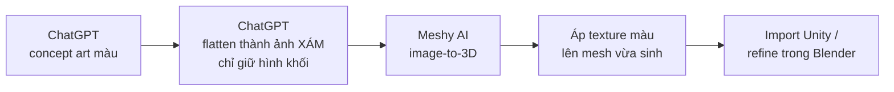

Ảnh concept màu **không** đưa thẳng vào Meshy. Nó phải qua một bước trung gian: chuyển
thành ảnh **xám, phẳng màu, chỉ còn hình khối** — đúng như log dự án đã ghi khi làm bộ
trụ nguyên tố: *"flat grayscale 3D models with detail left to texture rather than
geometry"* — dồn toàn bộ chi tiết bề mặt vào bước texture sau này, không để nó lọt vào
bước tạo mesh.

**Vì sao phải xám hoá trước khi đưa vào Meshy.** Meshy sinh mesh từ ảnh bằng cách suy ra
độ sâu/hình khối từ **tương phản trong ảnh** — vùng sáng-tối, ranh giới màu sắc đều bị
model đọc như một gợi ý về địa hình bề mặt. Đưa thẳng ảnh màu có vân gỗ, hoạ tiết, bóng
đổ vào, Meshy sẽ cố "khắc" những chi tiết đó thành hình học thật — tốn hẳn một lượng
tris/face để mô phỏng cái vốn dĩ chỉ nên là texture phẳng. Ảnh xám không có gì để đọc
nhầm như vậy, nên Meshy chỉ còn dựng đúng phần hình khối.

Đúng hai tấm ảnh minh hoạ cho thấy chênh lệch đó bằng số liệu thật, cùng một loại prop
(cổng chuông):

**Input đưa vào Meshy — model xám, chỉ còn hình khối:**

<p>
  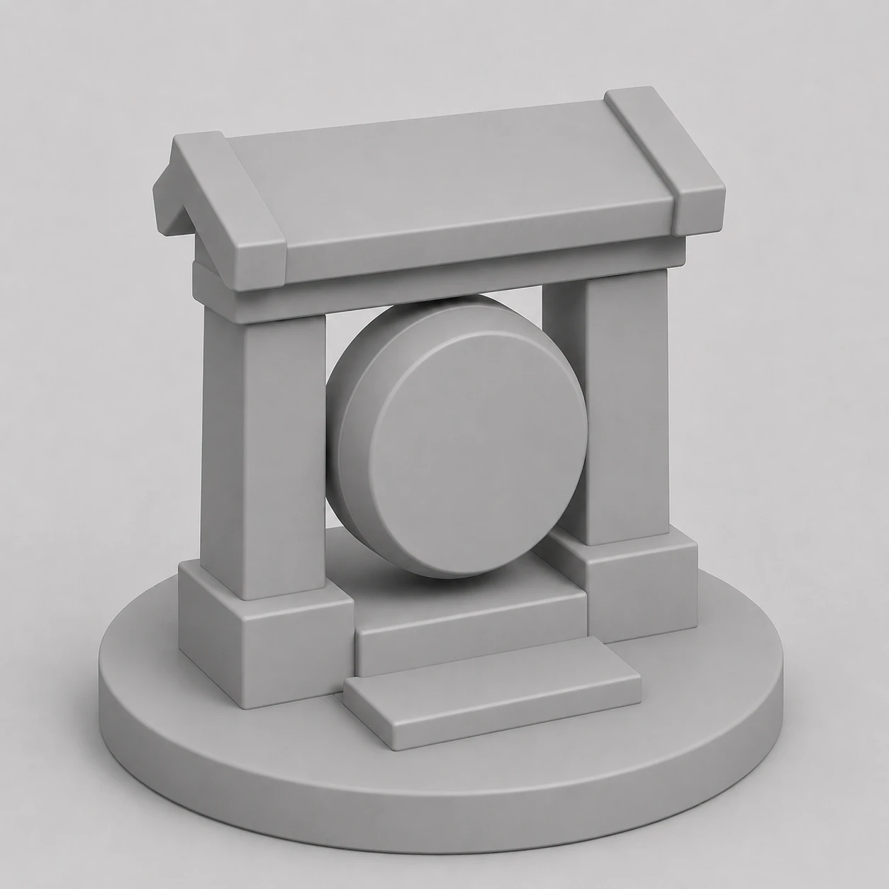
</p>

**Mesh Meshy sinh ra — so sánh trực tiếp ảnh màu vs ảnh xám:**

<p>
  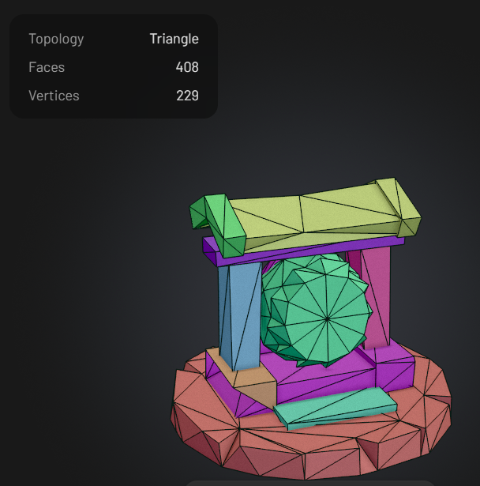
  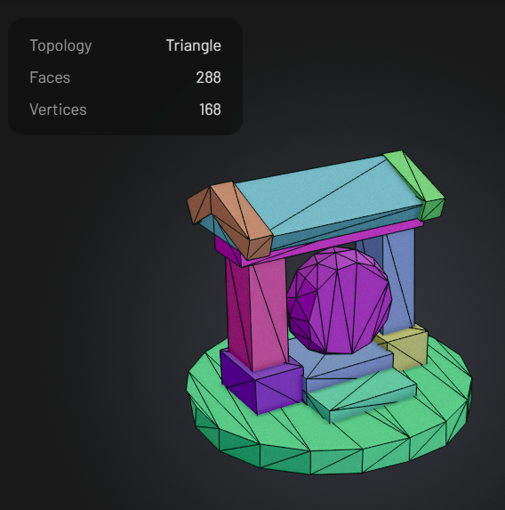
</p>

**Kết quả cuối sau khi áp texture màu lên mesh:**

<p>
  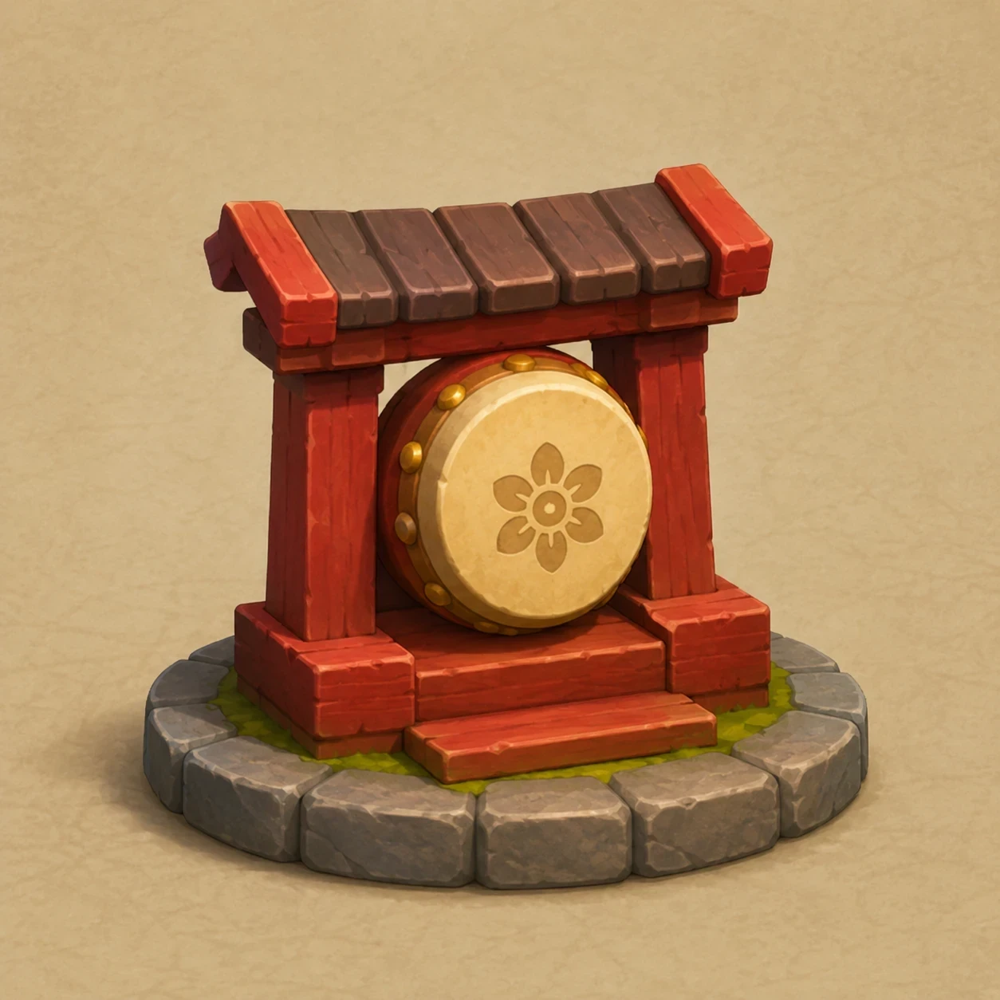
  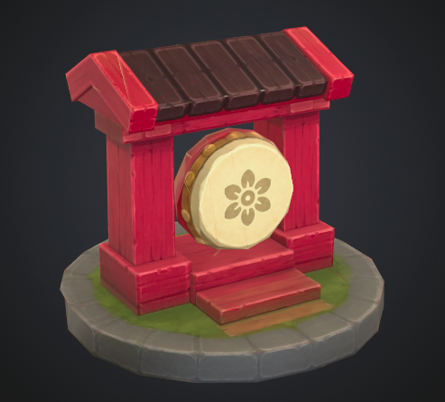
</p>

| Input cho Meshy | Faces | Vertices |
|---|---|---|
| Ảnh có màu/hoạ tiết | 408 | 229 |
| Ảnh xám, chỉ hình khối | 288 | 168 |

Ít hơn **~29% face, ~27% vertex** chỉ nhờ đổi cách chuẩn bị ảnh đầu vào — chưa cần đụng
tới bất kỳ bước tối ưu mesh nào ở Blender.

#### Animation: model có rig sẵn từ Meshy, nhưng rig đó thường chưa dùng được ngay

Meshy tự rig model qua `UniRig` khi sinh model động vật/quái, đôi khi kèm sẵn vài clip.
Trong project: Pebble Pal có sẵn rig 24 xương + 2 animation, Gà trống có sẵn rig 22 xương
nhưng **0** animation, Chuột có sẵn rig nhưng chỉ **1** animation (đi bộ).

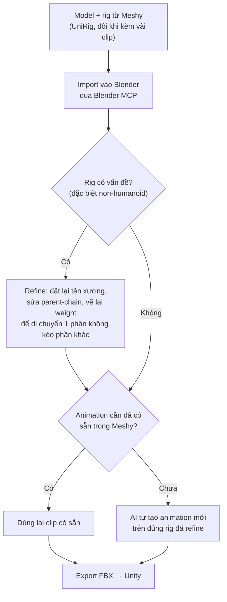

**Vì sao bắt buộc phải có bước refine, không dùng thẳng rig Meshy trả về.** Auto-rig của
Meshy không chuẩn, rõ nhất ở model **non-humanoid** — nơi không có bộ xương chuẩn hoá sẵn
như dáng người để đối chiếu. Ba lỗi thật đã gặp trong project:

- **Tên xương vô nghĩa.** Rig chuột ra `Bone_000`…`Bone_021` — không tự suy luận được
  xương nào là chân trước, xương nào là đuôi, phải đo đạc thủ công trước khi animate.
- **Parent-chain sai làm giới hạn chuyển động.** Rig gà có xương chậu (`pelvis`) làm cha
  của **cả hai chân lẫn cột sống** — cấu trúc này không thể diễn tả nghiêng thân mà không
  kéo lệch cả hai chân theo, vì thiếu một khớp IK tách biệt.
- **Weight rò sang phần không nên di chuyển.** Rig chuột: chỉ riêng xoay vai đã làm **bụng
  xẹp mất 31.5% thể tích**, vì weight của xương vai bị vẽ lan sang vùng bụng. Đo bằng cách
  cô lập từng nhóm xương và đo thể tích mesh mới tìm ra đúng xương gây lỗi — thử "taper"
  giảm weight không cải thiện được bao nhiêu (−36.6% → −36.4%), chứng minh đây là giới hạn
  thật của linear-blend-skinning chứ không sửa bằng cách chỉnh nhẹ được.

Bước refine chính là **sửa đúng ba loại lỗi này**: đặt lại tên/vai trò xương cho rõ nghĩa,
sửa lại parent-chain nếu cấu trúc chặn mất chuyển động cần có, vẽ lại weight để di chuyển
một phần cơ thể (vai, chân) không kéo méo phần khác (bụng, đuôi) đang phải đứng yên.

**Chỉ sau khi rig đã refine xong**, AI mới bắt đầu tạo animation — và **chỉ tạo cái Meshy
chưa có sẵn**. Chuột chỉ có sẵn animation đi bộ nên AI tự thêm idle và một skill đứng hai
chân kêu; gà không có animation nào nên AI tự tạo cả idle lẫn animation gáy, trên đúng rig
đã sửa lỗi ở bước trước — không animate trên rig gốc còn lỗi, vì mọi animation dựng trên
rig lỗi đều thừa hưởng lại đúng những vấn đề đó.

### 6.2 Workflow AI cho code

AI đọc/sửa code trong project qua một chuỗi tool cố định, mỗi tool đúng một việc (đã nói
lý do từng tool ở mục 5.2):

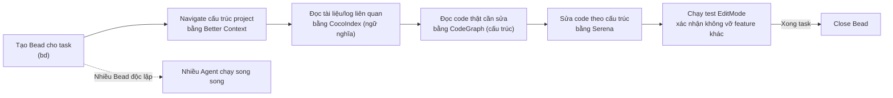

**Bead được tạo ngay khi bắt đầu một task** — không chỉ để ghi chú, mà để **nhiều Agent
chạy song song** trên cùng project: mỗi Agent nhận một Bead riêng, Beads giữ quan hệ
dependency/blocker giữa các task nên Agent này không giẫm lên phần việc Agent kia đang
làm, và tiến độ vẫn đọc lại được dù phiên chat nào đó đã kết thúc.

**Better Context chứa gì, cụ thể.** Đây không phải một file mô tả chung chung — nó là 217
file `AGENTS.md` sinh tự động, một file cho mỗi thư mục trong `Assets`, mỗi file có:

- **Tóm tắt module** — thư mục này định nghĩa những gì (ví dụ: "Unity source module
  defining ActiveLevelSystemSlot, ApplicationEntryPoint…")
- **Số liệu định lượng** — số file, số symbol public (ví dụ `Assets/Scripts`: 286 file,
  2444 symbol)
- **Phân lớp kiến trúc theo heuristic** — bao nhiêu file thuộc application/domain/
  infrastructure/presentation/shared, tự suy ra chứ không cần đọc lại từng file
- **File trọng yếu theo PageRank** — xếp hạng file nào được tham chiếu nhiều nhất trong
  thư mục đó, gợi ý nên đọc file nào trước
- **Bản đồ thư mục con** kèm link — đi từ thư mục cha xuống con mà không cần `ls`/`find`

AI đọc đúng file `AGENTS.md` ở thư mục liên quan là có ngay bối cảnh, không phải mở từng
file `.cs` để tự suy luận cấu trúc.

**Test viết đa số ở EditMode, nhờ đúng ranh giới đã nói ở mục 1.** Vì `System` tách khỏi
`MonoBehaviour` (mục 1.1), AI viết test cho một tính năng mà **không cần hiểu hết những
tính năng khác đang chạy trong scene** — test chỉ `new` đúng system cần test, đưa input
giả, kiểm tra output. Ranh giới assembly (mục 1.1) là thứ khiến AI **không lạc đường**:
sửa `TowerNetworkSystem` không thể vô tình chạm vào `GameplayUISystem` vì hai bên không
tham chiếu nhau, và test EditMode báo lỗi ngay nếu một thay đổi tưởng chừng độc lập lại
kéo theo tác dụng phụ ở nơi khác — phát hiện tại chỗ, không phải sau khi build xong cả
game mới biết.

#### Skills chuyên biệt cho Unity — tra đúng chủ đề thay vì đoán cách làm

Ngoài chuỗi tool ở trên, AI còn dùng một thư viện **84 skill Unity** (`.agents/skills/`)
— mỗi skill là tài liệu tham khảo cho đúng một pattern/chủ đề, nạp khi task chạm đúng chủ
đề đó thay vì AI tự nhớ lại (và có thể nhớ sai) cách làm chuẩn. Các skill đã dùng thật,
khớp trực tiếp với từng mục trong tài liệu này:

| Skill | Dùng cho mục nào trong spec này |
|---|---|
| `dev-unity-vcontainer` | 1.2 VContainer |
| `dev-unity-assembly-definitions` | 1.1 Layered Architecture |
| `dev-unity-facade-pattern` | 1.4 Facade |
| `dev-unity-observer-pattern` | 1.6 Observer |
| `dev-unity-object-pooling` | 2.3 Object Pool |
| `dev-unity-dotween-pro` | 2.8 DOTween |
| `dev-unity-audio-system` | 2.6 Audio Pool |
| `dev-unity-save-load-persistence` | 3.2 JSON Save System |
| `dev-unity-responsive-ui` | 4.5 Raycast Target, mục UI nói chung |
| `dev-unity-performance-profiling` / `dev-unity-optimizers` | 4.3 Batching & Instancing — dùng lúc đo bằng Frame Debugger trước/sau khi tách instancing |
| `dev-unity-mcp` | Toàn bộ số liệu tra trực tiếp bằng Unity MCP ở mục 4 |
| `dev-unity-gameplay-architecture` | Khung tổng thể mục 1–2 |
| `beads` | 6.2 — quy trình tạo Bead theo task |
| `dev-unity-clean-code-principles` | Áp dụng ngang khi review/sửa code, không gắn với một mục cụ thể |

Skill khác với tool đọc/sửa code (CocoIndex/CodeGraph/Serena) ở chỗ nó không đọc dữ liệu
của project — nó nạp **kiến thức chuẩn về một pattern Unity** (khi nào dùng, đánh đổi gì,
lỗi thường gặp) để áp đúng vào ngữ cảnh project đang có, tránh việc AI tự bịa ra một biến
thể pattern không khớp quy ước Unity thật.

---

## 7. Dung lượng & Performance

### 7.1 Dung lượng build

Bản nộp `game.apk` — **149.7 MB**, 452 file, universal APK (một file chạy được cho cả
ARM64 lẫn ARMv7), IL2CPP, không tách AAB.

| Thành phần | Dung lượng (đã nén) | Tỉ lệ |
|---|---|---|
| `assets/bin/Data` — nội dung game | **77.9 MB** | 52% |
| `lib/` — thư viện native (cả **hai** ABI) | **63.9 MB** | 43% |
| `assets/APVStreamingAssets` — dữ liệu Adaptive Probe Volume | 4.7 MB | 3% |
| `classes.dex` | 2.4 MB | 2% |
| `res/`, `resources.arsc`, còn lại | 0.8 MB | < 1% |

Bóc tiếp hai khối lớn:

```
assets/bin/Data                        lib/
  data.unity3d          61.4 MB          arm64-v8a/   32.9 MB
  sharedassets0.res      7.7 MB            libil2cpp.so  19.9 MB
  resources.resource     4.6 MB            libunity.so   12.4 MB
  global-metadata.dat    3.2 MB          armeabi-v7a/ 31.0 MB
                                            libil2cpp.so  19.2 MB
                                            libunity.so   11.3 MB
```

#### Ba điều con số này nói ra

**1. Gần 31 MB là phần chết trên mọi máy.** `AndroidTargetArchitectures: 3` nghĩa là APK
mang cả ARM64 lẫn ARMv7. Một thiết bị chỉ nạp đúng một bộ; bộ còn lại vẫn phải tải về và
vẫn chiếm chỗ trên máy. Đây là cái giá của việc nộp **một file APK chạy được ở mọi nơi**
thay vì AAB — với bài nộp thì một file duy nhất là đúng yêu cầu, nhưng nếu phát hành lên
Play Store thì AAB (Google Play tự cắt theo ABI của từng máy) hoặc đơn giản là bỏ ARMv7
sẽ cắt ngay ~31 MB mà không đụng vào một asset nào.

**2. `stripEngineCode: 0` — engine code stripping đang tắt.** `libunity.so` và
`libil2cpp.so` cộng lại chiếm 63.9 MB vì mọi module của engine đều được mang theo, kể cả
những module không hề được gọi tới. Đây cũng chính là chỗ mà "gói cài nhưng chưa dùng" ở
phần Ghi chú cuối tài liệu trả giá bằng dung lượng thật. Bật stripping và nâng
`Managed Stripping Level` là đòn bẩy lớn thứ hai sau ABI — nhưng là đòn bẩy **có rủi ro**:
stripping cắt theo phân tích tĩnh, nên code chỉ được gọi qua reflection hoặc qua
`SerializeReference` có thể bị cắt nhầm và chỉ lộ ra lúc chạy trên thiết bị. Đổi lại là
phải test lại toàn bộ 10 màn trên máy thật, nên không bật cho bản nộp này.

**3. 61.4 MB `data.unity3d` là nội dung, và nó lớn vì đúng lý do.** Toàn bộ 10 màn, mesh,
texture, audio, lightmap đã bake (mục 4.2) nằm hết trong đây, không có Addressables hay
AssetBundle nào để tải sau — game mở ra là chơi được ngay, không cần mạng. Với một game
thủ thành 10 màn thì đánh đổi này đúng; nó chỉ sai khi số màn tăng tới mức người chơi phải
tải về những màn họ chưa mở khoá.

Lightmap và APV là phần dung lượng **được mua có chủ đích**: mục 4.2 đổi chi phí GPU mỗi
frame lấy dung lượng nằm yên trên đĩa — 4.7 MB APV cộng phần lightmap trong `data.unity3d`
chính là hoá đơn của việc tắt toàn bộ real-time shadow.

### 7.2 Playtest trên thiết bị thật

<p>
  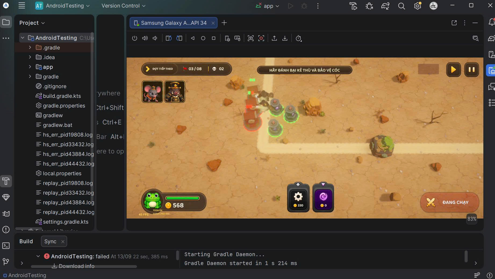
  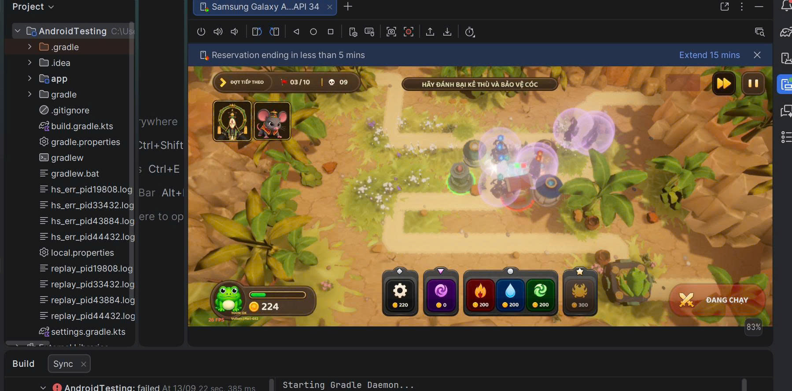
</p>

#### Cách đo

Thiết bị được mượn qua **Device Streaming của Android Studio** — máy thật đặt trong
data center của Google, stream màn hình về IDE, cài APK và điều khiển như máy cắm cáp
(ảnh bên phải còn thấy dòng "Reservation ending in less than 5 mins": phiên mượn có giới
hạn thời gian, phải xin gia hạn). Cách này cho phép đo trên đúng phân khúc máy mục tiêu mà
không cần sở hữu nó.

Máy chọn để đo là **Samsung Galaxy A04s** — máy phổ thông giá rẻ, cố tình chọn mức thấp
chứ không chọn máy mạnh:

| | |
|---|---|
| Chipset | Exynos 850, 8 nhân, 2.0 GHz |
| GPU | **Mali-G52** |
| RAM | 4 GB |
| Màn hình | 6.5" IPS LCD, **720 × 1600**, 90 Hz |
| Hệ điều hành | Android 12 One UI *(bản stream chạy API 34)* |

Số liệu đọc từ **HUD đo đạc dựng sẵn trong build** (góc dưới trái), hiển thị FPS tức thời
cùng graphics API và tên GPU đang thật sự chạy — `Vulkan | Mali-G52` xác nhận thiết bị
lấy nhánh Vulkan chứ không rơi về OpenGLES3 dự phòng (mục 4.1).

#### Kết quả

| Bối cảnh | FPS đo được |
|---|---|
| Màn visual đơn giản, ít object, 2 quái trên bàn cờ *(ảnh trái — đợt 03/08)* | **~45 FPS** |
| Màn nhiều object phức tạp, 9 quái + nhiều VFX kỹ năng và khiên chồng lên nhau *(ảnh phải — đợt 03/10)* | **~25–30 FPS** |

Trần 60 FPS đặt ở `FramePacingSystem` (mục 4.1) không đạt được trên máy này ở cả hai
trường hợp — con số đó là trần, không phải mục tiêu đã chạm tới.

#### Đọc con số này

Điểm đáng chú ý là **khoảng cách giữa hai lần đo, chứ không phải con số tuyệt đối**. Cùng
một build, cùng một thiết bị, cùng luật chơi: chênh lệch ~45 xuống ~26 đến từ **những gì
được vẽ**, không đến từ logic. Logic game là tất định và chạy theo tick cố định (mục 2.1)
— thêm quái làm tăng chi phí mô phỏng, nhưng chi phí đó đã được tính trước cả đợt và
không nhân lên theo VFX.

Thứ nhân lên theo VFX là **fill rate**. Ảnh bên phải có nhiều quầng khiên trong suốt chồng
lên nhau, mỗi quầng tô lại toàn bộ số pixel nó phủ; trên một GPU phân khúc phổ thông như
Mali-G52 thì overdraw của vật thể trong suốt là giới hạn tới trước, chứ không phải số draw
call hay số vertex. Đây đúng là lý do những quyết định ở mục 4 nhắm vào **số pixel phải
tô** hơn là vào số object: `Render Scale 0.8`, Bloom ở Quarter với 4 tầng, real-time shadow
tắt hẳn, MSAA giữ thấp. Không có chúng, con số ~26 FPS ở ảnh phải sẽ còn thấp hơn nữa.

Hướng tối ưu tiếp theo, nếu có thêm thời gian, nằm ở đúng chỗ phép đo chỉ ra: giới hạn số
hiệu ứng trong suốt được phép chồng lên nhau cùng lúc, và hạ độ phân giải riêng cho lớp
VFX thay vì hạ tiếp `Render Scale` của cả khung hình.

---

## Ghi chú: gói cài nhưng chưa dùng

Ba gói/thư viện có mặt trong `Packages/manifest.json` nhưng qua rà soát **không tìm thấy
lần sử dụng nào** trong `Assets/Scripts` hay trong scene/prefab — nêu ra để minh bạch, vì
đây cũng là một phần thật của tech stack (dù là phần nên dọn):

- **Cinemachine 3.1.7, Timeline 1.8.12, VFX Graph 17.3.0, ProBuilder 6.1.2, glTFast
  6.19.0** — cài sẵn, 0 component nào dùng trong scene/prefab, 0 file `.cs` nào import
- **ZLinq**, **Newtonsoft.Json** — có trong `Packages/nuget-packages`, 0 lần `using` trong
  `Assets/Scripts`; game dùng LINQ chuẩn của .NET và `JsonUtility` (mục 3.2), không dùng
  hai gói này
- **Animation Rigging** — ngoại lệ nhỏ: có dùng thật, nhưng chỉ ở đúng **một** prefab
  (`CrabFiringLeftClaw.prefab`, `RigBuilder` cho chuyển động càng cua) — quá nhỏ để tính
  là một kỹ thuật của project, nhưng đủ thật để không xếp chung vào nhóm "chưa dùng" ở trên

Không xoá các gói này khỏi tài liệu hay khỏi project — chỉ ghi nhận đúng thực trạng để
không ai đọc `manifest.json` rồi tưởng nhầm đây là kỹ thuật chính của game.
