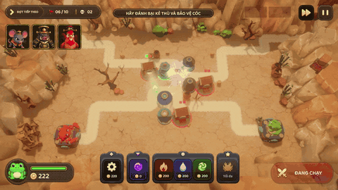
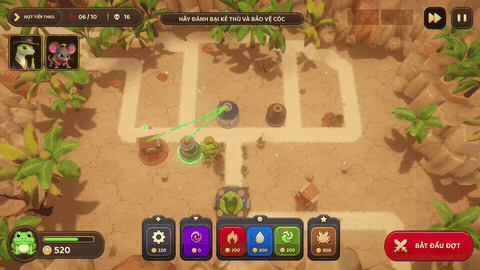
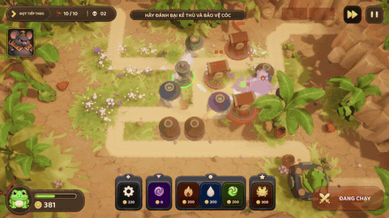
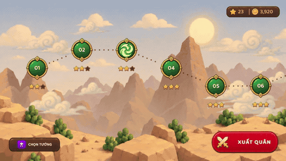

# Hạn Trời — Tower Defense 3D

A mobile tower defense game made in Unity 6.3 for Android.

Towers here do not shoot on their own. You **wire them into a chain**, and a single projectile
travels down that chain, picking up a new element from every tower it passes through before it
reaches the end. The network *is* the weapon — where you put a tower matters less than what
order it sits in.

## Showcase

**Wiring a chain** — drag a tower onto the grid, then drag from tower to tower to link them.



**The Crab hero** — the one tower that ignores the network and fights on its own, stunning
whatever it hits. One per level.



**Level 10 boss** — a boss that stands on the road and summons waves at you, then walks into
the fight itself for the final wave.



**HUD** — selecting a tower, upgrading it, selling it, reading the next wave.



<sub>Clips above are silent looping previews. Full-quality MP4s live in
[`Showcase/`](Showcase) — GitHub only plays video it hosts itself, so repo-hosted MP4s cannot
be embedded inline.</sub>

## How it plays

You defend a frog sitting at the end of a road. Enemies walk that road; if they reach the frog,
it loses health, and losing all of it ends the run.

Between waves you build. A chain only works if it runs all the way from a **Generator** (which
creates the projectile) through your **elemental towers** (fire, water, wind — each one stamps
its element onto the projectile passing through) and into the **Soul Nexus** at the end. A tower
that is not part of a complete chain sits there doing nothing, and the Start Wave button stays
locked until at least one chain is finished.

That rule is what makes the game a puzzle rather than a shooting gallery. A fire tower placed
in a great spot is worthless if nothing feeds it, and the same three towers wired in a different
order produce a different projectile.

Elements also react with each other. Fire and water leave marks on an enemy, and when two marks
meet you get a reaction — burning, being lifted off the ground, thermal shock that cracks armour.
Building a chain is really about deciding which reaction you want to happen and where.

There are **10 levels**, each with its own road, wave schedule and enemy mix, plus a tutorial
that walks through the first few. Clearing a level without letting the frog take a single hit
earns 3 stars; above half health is 2; below is 1.

## Under the hood

Short version of the technical spec.

| Area | Approach |
| --- | --- |
| **Structure** | Plain C# simulation in `System/`, Unity-facing code in `Components/`, composition in `Application/`. 6 assembly definitions keep the dependency direction one-way |
| **Dependency injection** | VContainer with two scopes — one for the app, one per level. Leaving a level disposes 33 systems at once, so no state leaks into the next level |
| **Combat** | Fixed 0.05 s tick, and the whole wave is **simulated ahead of time** then replayed. Deterministic, frame-rate independent, and the tutorial can look ahead at events before they happen |
| **Tower network** | A directed graph with one outgoing link per tower. Chains are never stored — they are walked on demand, and only the set of towers inside a complete chain is cached |
| **Data** | 13 ScriptableObject types hold every rule, so designers tune numbers without touching code. Each asset validates itself at load, so bad data refuses to boot instead of breaking mid-run |
| **Saving** | Write to a temp file, read it back, then swap it in atomically. Keeps a backup and refuses save files from an older schema |
| **Rendering** | URP, Vulkan first, baked lighting, no real-time shadows. Two toon shader variants on purpose: one for SRP Batcher, one for GPU instancing, because the two are mutually exclusive |
| **Memory** | Pools for projectiles, enemies and audio voices; one shared particle rig for one-shot effects; sprite atlases split per screen; VFX and shaders warmed at boot |

Measured on a **Samsung Galaxy A04s** (Exynos 850, Mali-G52, 720×1600): **~45 FPS** on a light
board, **~25–30 FPS** with nine enemies and overlapping transparent effects. The gap is fill rate,
not logic — combat cost is precomputed and does not grow with the number of effects on screen.

The build is a 149.7 MB universal APK. Roughly 31 MB of that is the second CPU architecture,
which shipping an AAB instead would drop.

---

The rest of this file is the working convention for people contributing to the project.

## Repository layout

```text
TowerDefense3D/
├── Assets/
│   ├── Config/          # Authored ScriptableObject and settings instances
│   ├── Resources/       # Runtime-loadable animations, prefabs, models, materials, and textures
│   ├── Scenes/          # Bootstrap, gameplay levels, and test scenes
│   └── Scripts/         # Project-owned C# source
├── Builds/              # Ignored local player builds
├── Documents/           # Game design, technical specifications, and durable project records
├── Packages/            # Unity package manifest and lock file
├── ProjectSettings/     # Unity project settings
├── Recordings/          # Ignored raw capture footage
└── Showcase/            # Short demo clips linked from this README
```

## Source layout

Project-owned C# source uses technical boundaries at the root and feature ownership below `System`, `Components`, `Editor`, and `Tests`.

```text
Assets/Scripts/
├── Application/         # VContainer composition, entry point, scopes, and scene integration
│   ├── EntryPoint/
│   ├── Scenes/
│   └── Scopes/
├── System/              # Plain C# systems, rules, state, contracts, and definitions
│   ├── Core/            # Proven mechanisms shared by multiple System features
│   │   ├── Numerics/
│   │   ├── Simulation/
│   │   └── StateMachine/
│   └── <FeatureName>/
├── Components/          # MonoBehaviour boundaries authored in scenes and prefabs
│   ├── Core/            # Unity-facing mechanisms shared by multiple component features
│   │   ├── Lifecycle/
│   │   └── Pooling/
│   └── <FeatureName>/
├── Editor/              # Editor-only authoring, validation, and project test tools
│   └── <FeatureName>/
└── Tests/
    ├── EditMode/
    │   └── <FeatureName>/
    └── PlayMode/
        └── <FeatureName>/
```

### Dependency direction

- `Application` may depend on `Components`, `System`, and VContainer.
- `Components` may depend on `System` and Unity runtime APIs. It must not own application or system lifecycle.
- `System` contains player-build logic but must not depend on `Application`, `Components`, VContainer, `UnityEditor`, or test assemblies.
- `Editor` may depend on the exact runtime assemblies required by its tools.
- `Tests` may depend on the exact runtime assemblies required by each fixture.
- Dependencies must remain one-way and acyclic.

### Assembly paths

| Path | Assembly |
| --- | --- |
| `Assets/Scripts/Application/` | `TowerDefense3D.Application.Runtime` |
| `Assets/Scripts/System/` | `TowerDefense3D.System.Runtime` |
| `Assets/Scripts/Components/` | `TowerDefense3D.Components.Runtime` |
| `Assets/Scripts/Editor/` | `TowerDefense3D.Editor` |
| `Assets/Scripts/Tests/EditMode/` | `TowerDefense3D.EditModeTests` |
| `Assets/Scripts/Tests/PlayMode/` | `TowerDefense3D.PlayModeTests` |

## Asset and document paths

```text
Assets/Config/<FeatureName>/       # Authored ScriptableObject/settings instances
Assets/Resources/Animations/       # Runtime-loadable animation clips and controllers
Assets/Resources/Prefabs/          # Runtime-loadable prefabs
Assets/Resources/Models/           # Runtime-loadable models grouped by asset name
Assets/Resources/Materials/        # Runtime-loadable materials
Assets/Resources/Textures/         # Runtime-loadable textures
Assets/Scenes/Bootstrap.unity      # Persistent application composition scene
Assets/Scenes/Levels/Level_###.unity
Assets/Scenes/Tests/               # Test-only scenes
Documents/GameDesign/              # Game design documents
Documents/TechnicalSpec/           # Approved or proposed technical specifications
Documents/AICollaboration/         # Concise AI-assisted decision records
Builds/                            # Ignored local build output
```

## Folder and path rules

- Put plain gameplay logic in `Assets/Scripts/System/<FeatureName>/` and matching Unity-facing code in `Assets/Scripts/Components/<FeatureName>/`.
- Keep small features flat. Add responsibility folders such as `Definitions`, `Models`, `Rules`, `Views`, or `Presenters` only when multiple current files share that role.
- Do not add a redundant `Scripts` child beneath any source root.
- Put only proven cross-feature plain C# mechanisms in `System/Core`; Core must not depend on a gameplay feature.
- Put only proven cross-feature Unity-facing mechanisms in `Components/Core`; gameplay rules remain in `System` features.
- Do not create speculative `Common`, `Helpers`, `Ports`, or additional `Core` folders without multiple concrete consumers.
- Keep boundary interfaces beside the system that owns the requirement unless a real cross-system module justifies another location.
- Use role-revealing postfixes for peers at the same level, such as `*System`, `*View`, `*Presenter`, `*Source`, and `*Factory`.
- Store ScriptableObject type definitions in their owning source feature and store authored `.asset` instances under `Assets/Config/<FeatureName>/`.
- Keep general-purpose loadable assets under the matching `Assets/Resources/<Category>/` folder. Do not create singular alternatives such as `Assets/Resources/Model/`.
- Use stable descriptive file and asset names. Do not append opaque labels such as `V1`, `V2`, `Latest`, or `Final` unless they are part of an explicit compatibility contract.
- Preserve `.meta` files and GUIDs when moving Unity files. Update literal `Resources.Load` or `AssetDatabase.LoadAssetAtPath` paths together with the move.
- Preserve stable namespaces during folder-only moves unless a separately approved change updates the namespace contract.

## C# line wrapping

- Keep method signatures, calls, assignments, declarations, and conditions on one readable line while they remain reasonably short. About 120 characters is a readability target, not a hard limit.
- Wrap only when a line becomes materially difficult to scan.
- Break at logical argument or condition groups and indent continuation lines consistently.
- Do not place every argument, operand, or assignment fragment on a separate line merely because an expression contains several items.
- Apply formatting cleanup only to files already touched by the current change; do not create unrelated formatting churn.

